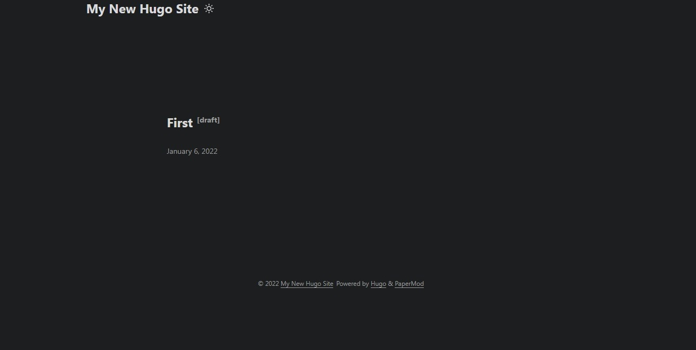
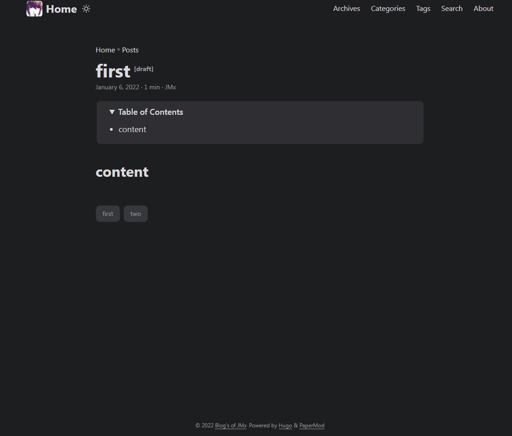
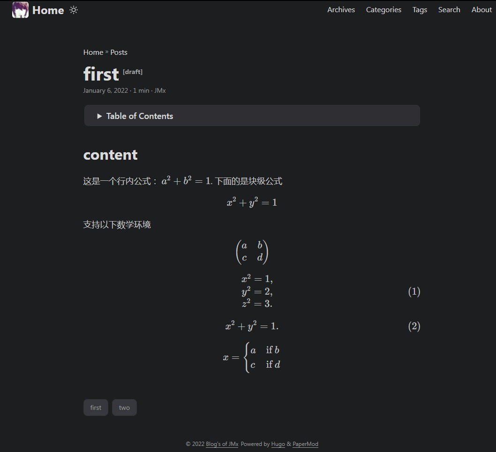
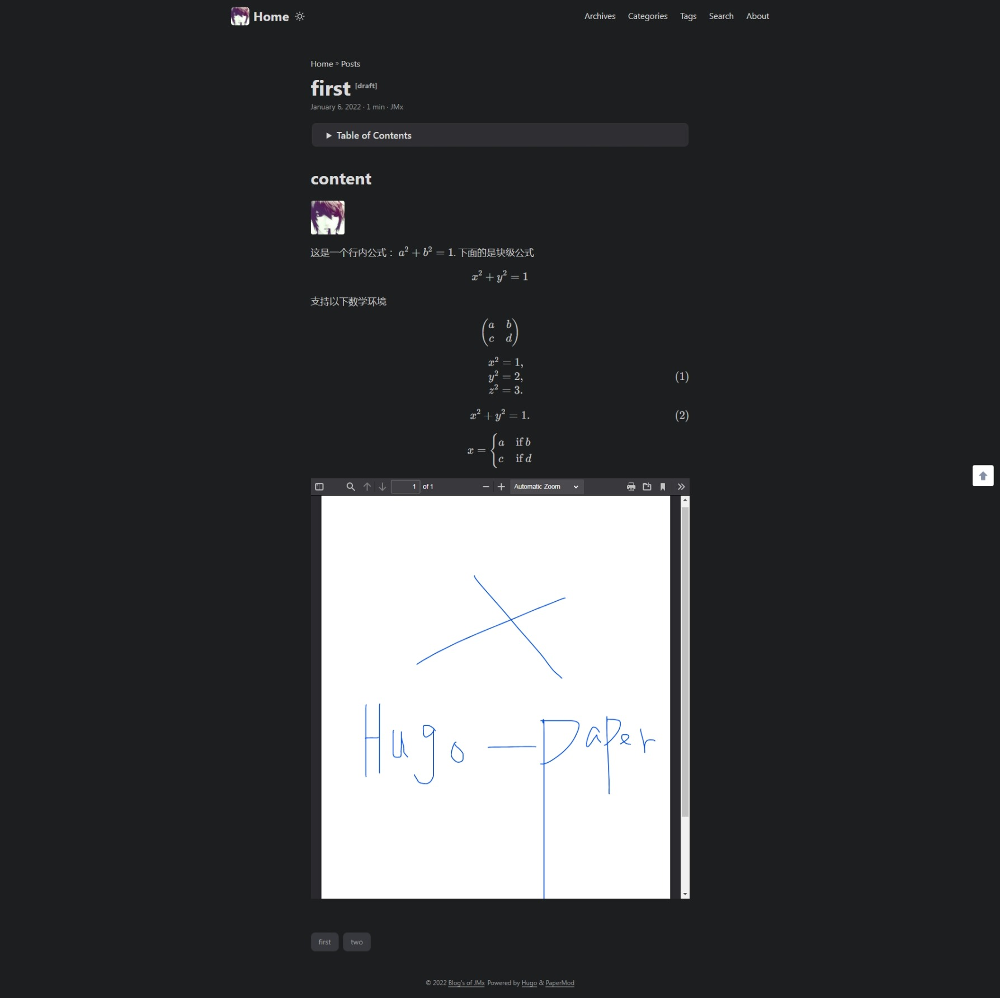

## 安装

首先下载[Hugo程序](https://github.com/gohugoio/hugo/releases)，我们将其放在目录`D:/Hugo/bin/hugo.exe`。 然后将该路径添加到环境变量`Path`中`...;D:/Hugo/bin/`。 在命令行输入`hugo version`并回车，可以查看hugo的版本信息，则环境配置成功。

然后我们就可以使用命令行工具创建网站项目。 创建网站项目名为mysite，放在E盘
```
E:\> hugo new site mysite
```
回车即初始化项目，可以得到`E:/mysite/`文件夹，包含以下文件(夹)
```
archetypes/
content/
data/
layouts/
static/
themes/
config.toml
```
这样我们就创建了一个空的项目。


## 主题
Hugo有很多适配的主题，免去了我们重新设计的麻烦。 这里我们使用主题[PaperMod](https://github.com/adityatelange/hugo-PaperMod)来说明如何使用。

首先将该仓库下载解压至`E:/mysite/themes/papermod`文件夹下， 它包含以下文件(夹)
```
.git/
.github/
assets/
i18n/
layouts/
...
```
前两个github库相关文件夹可以删除。 然后我们就可以创建页面。 命令行输入(当然也可以用记事本等软件新建md文件)
```
E:\mysite> hugo new post/first/index.md
```
回车即成功创建文件`E:/mysite/content/post/first/index.md`。 命令行启动server
```
E:\mysite> hugo server -t papermod --buildDrafts
```
回车即返回编译成功，并生成地址：`localhost:1313`。 用浏览器打开该地址， 即可得到我们的主页面

可以看到我们创建的第一个文件first。

我们可以对主页面进行如下配置。 将文件`E:/mysite/config.toml`重命名为`config.yml`，内容修改为
```yml
publishDir: docs
baseURL: "https://jiandandaoxingfu.github.io/hugo-papermod"
title: hugo-papermod
paginate: 5
theme: PaperMod

enableRobotsTXT: true
buildDrafts: true
buildFuture: false
buildExpired: false

minify:
    disableXML: true
    minifyOutput: true

params:
    env: production
    title: hugo-papermod
    description: hugo-papermod
    keywords: [Hugo, PaperMod]
    author: JMx
    DateFormat: "January 2, 2006"
    defaultTheme: auto # dark, light
    disableThemeToggle: false

    ShowReadingTime: true
    ShowShareButtons: false
    ShowPostNavLinks: true
    ShowBreadCrumbs: true
    ShowCodeCopyButtons: false
    disableSpecial1stPost: false
    disableScrollToTop: false
    comments: true
    hidemeta: false
    hideSummary: false
    showtoc: true
    tocopen: false

    assets:
        favicon: https://jiandandaoxingfu.github.io/hugo-papermod/favicon.ico
        favicon16x16: https://jiandandaoxingfu.github.io/hugo-papermod/favicon.ico
        favicon32x32: https://jiandandaoxingfu.github.io/hugo-papermod/favicon.ico
        apple_touch_icon: https://jiandandaoxingfu.github.io/hugo-papermod/favicon.ico
        safari_pinned_tab: https://jiandandaoxingfu.github.io/hugo-papermod/favicon.ico

    label:
        text: "Home"
        icon: https://jiandandaoxingfu.github.io/hugo-papermod/favicon.ico
        iconHeight: 35

    cover:
        hidden: false # hide everywhere but not in structured data
        hiddenInList: false # hide on list pages and home
        hiddenInSingle: false # hide on single page

    fuseOpts:
        isCaseSensitive: false
        shouldSort: true
        location: 0
        distance: 1000
        threshold: 0.6
        minMatchCharLength: 3
        keys: ["title", "summary", "content", "permalink"]
menu:
    main:
        - identifier: archives
          name: Archives
          url: /archives/
          weight: 10
        - identifier: categories
          name: Categories
          url: /categories/
          weight: 20
        - identifier: tags
          name: Tags
          url: /tags/
          weight: 30
        - identifier: search
          name: Search
          url: /search/
          weight: 40
        - identifier: about
          name: About
          url: /about/
          weight: 50
outputs:
    home:
        - HTML
        - RSS
        - JSON
```
有如下几点需要注意:
1. `publishDir: docs`, 这里是指将项目生成的静态文件放在`E:/mysite/docs/`文件夹下， 便于我们后面将项目发布到github pages。

2. `baseURL: https://username.github.io/hugo-papermod/`是我们github pages的主目录。 即我们将整个仓库放在hugo-papermod仓库中。

3. icon地址需要是绝对地址， 发布以后切换页面时才可以正常显示图标。 其中assets是网站图标， label是主页面标题的图标。 


为了让主页面的几个按钮正常工作， 我们需要创建几个文件
- `E:/mysite/content/about.md`
```yml
---
title: "Who Am I?"
# url: "/about"
# description: "Description for about"
summary: "about"

searchHidden: true
showToc: false
hidemeta: true
ShowBreadCrumbs: false
ShowReadingTime: false
ShowPostNavLinks: false
---

---

<!-- content -->
```

- `E:/mysite/content/archives.md`
```yml
---
title: "Archives"
layout: "archives"
summary: "archives"
---
```

- `E:/mysite/content/search.md`
```yml
---
title: "Search"
layout: "search"
summary: "search"
---
```
这样就基本完成了主页面。 

对于子页面， 放在`E:/mysite/content/post/`文件夹下就可以了。 例如我们更改`E:/mysite/content/post/first/index.md`为
```yml
---
title: "first"
date: 2022-01-06 18:13:52.872 +0800
summary: 'How to use hugo with the theme "paperMod"'
weight: 1
tags: ["first", "two"]
categories: ["first"]
author: "JMx"
showToc: true
TocOpen: false
draft: true
hidemeta: false
comments: false
disableHLJS: true 
disableShare: true
hideSummary: false
searchHidden: false
ShowReadingTime: true
ShowBreadCrumbs: true
ShowPostNavLinks: true
---

## content
```
则此页面显示为

至此我们完成了基本功能。 需要注意的是，我们将此页面引用的图片放在`E:/mysite/content/post/first/images/`文件夹下。


## 配置数学环境
下面， 我们使其支持数学环境。 创建模板文件`E:/mysite/themes/papermod/layouts/shortcodes/katex.html`， 这里我们使用katex：
```html
<div id="katex-support">
    <link rel="stylesheet" href="https://cdn.jsdelivr.net/npm/katex@0.15.1/dist/katex.min.css" integrity="sha384-R4558gYOUz8mP9YWpZJjofhk+zx0AS11p36HnD2ZKj/6JR5z27gSSULCNHIRReVs" crossorigin="anonymous">
    <script defer src="https://cdn.jsdelivr.net/npm/katex@0.15.1/dist/katex.min.js" integrity="sha384-z1fJDqw8ZApjGO3/unPWUPsIymfsJmyrDVWC8Tv/a1HeOtGmkwNd/7xUS0Xcnvsx" crossorigin="anonymous"></script>
    <script defer src="https://cdn.jsdelivr.net/npm/katex@0.15.1/dist/contrib/auto-render.min.js" integrity="sha384-+XBljXPPiv+OzfbB3cVmLHf4hdUFHlWNZN5spNQ7rmHTXpd7WvJum6fIACpNNfIR" crossorigin="anonymous"></script>
    <script type="text/javascript">
      document.addEventListener("DOMContentLoaded", function() {
      renderMathInElement(document.body, {
          delimiters: [
              {left: '$$', right: '$$', display: true},
              {left: '$', right: '$', display: false},
              {left: "\\begin{equation}", right: "\\end{equation}", display: true},
              {left: "\\begin{cases}", right: "\\end{cases}", display: true},
              {left: "\\begin{pmatrix}", right: "\\end{pmatrix}", display: true},
              {left: "\\begin{array}", right: "\\end{array}", display: true},
              {left: "\\begin{align}", right: "\\end{align}", display: true}
            ],
            throwOnError : false });
      });
  </script>
</div>    
```
然后只需要在用到数学公式的文章开头引入该模板。 为了查看效果， 我们在`E:/mysite/content/post/first/index.md`文件中追加如下代码
```markdown
...
---
{%{< katex >}} % 删除"%".
## content
这是一个行内公式： $a^2+b^2=1$. 下面的是块级公式
$$ 
x^2+y^2=1 
$$
支持以下数学环境
\begin{pmatrix}
   a & b \\\\
   c & d
\end{pmatrix}

\begin{equation}
\begin{array}{l}
	& x^2 = 1, \\\\
	& y^2 = 2, \\\\
	& z^2 = 3.
\end{array}
\end{equation}

\begin{equation}
	x^2 + y^2 = 1.
\end{equation}

$$
x = \begin{cases}
   a &\text{if } b \\\\
   c &\text{if } d
\end{cases}
$$
```
则有

需要注意的是， 下划线作为markdown特殊词义， 我们需要将公式中的下划线转义，即使用`\_`。

## 支持PDF文件阅读
类似于数学环境， 我们可以引入pdf.js来支持pdf文件阅读。 首先下载[pdfjs](https://github.com/mozilla/pdf.js/releases/download/v2.12.313/pdfjs-2.12.313-dist.zip)， 解压后将其放在`E:/msite/static/js/pdf-js/`文件夹下。 删除不必要文件后，结构如下
```
pdf-js/web/viewer.html
pdf-js/web/viewer.js
pdf-js/web/viewer.css
pdf-js/web/images/

pdf-js/build/pdf.js
pdf-js/build/pdf.worker.js
```
然后修改`viewer.js`文件。 首行添加命令
```javascript
const _url_ = window.location.href.split("?")[1];
```
然后将文件中默认打开的文件`compressed.tracemonkey-pldi-09.pdf`改为`_url_`。 
接着创建文件`E:/mysite/themes/papermod/layouts/shortcodes/embed-pdf.html`
```html
<div id="container">
    <script type="text/javascript">
        var url = "{{.Site.BaseURL}}" + '{{ .Get "url" }}';
        var div  = document.getElementById('container');
        div.innerHTML += `<iframe src=/hugo-papermod/js/pdf-js/web/viewer.html?${url} frameborder="0" width="100%" height="900px"></iframe>`
    </script>
</div>
```
同样地，我们在需要引入pdf文件的文章中添加
```
{%{< embed-pdf url="post/first/files/test.pdf" >}}         % 删除"%"
```
结果如下


## 部署到Github Pages
下面， 我们将上述项目放在github中， 并启用github pages。 首先用hugo生成静态页面
```
E:\mysite> hugo
```
回车后hugo会将文章生成html页面， 放在docs文件夹下。 然后我们创建仓库`hugo-papermod`(前面我们已经假设此仓库建好了，并且有icon图片)。 然后打开github pages， 选择main->docs保存发布即可访问。


## 总结
上面我们只是简单说该主题如何使用， 并没有过多介绍config.xml文件， 对其不同设置， 可以得到不同的主页面， 参见

1. https://gohugo.io/

2. https://adityatelange.github.io/hugo-PaperMod/

3. https://chrispanag.com/

4. https://github.com/anvithks/hugo-embed-pdf-shortcode


