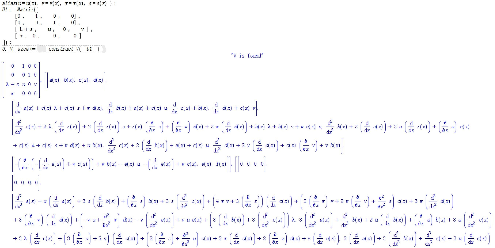




	
这里我们记录一下使用Maple自动推导离散谱问题的时间部分的$V$的形式。

## 算法

我们以$4$阶谱问题为例。 给定空间谱问题$U(n, \lambda)=(U\_{ij})\_{4\times 4}$ (这里我们限定$U$中的同一位势不重复出现, 否则需要考虑相容性条件)，我们设$V(n, \lambda)=(V\_{ij})\_{4\times 4}$，则静态零曲率方程
\begin{equation}
	S=V^+U - UV = 0
\end{equation}
是包含$16$个未知量的线性方程。 

我们的目的是构造恰当的$V$的形式，使得静态零曲率方程满足下面两个条件：
- (C1): 如果$ \dfrac{\partial U\_{ij}}{\partial n}\neq 0$ (即含有位势)，则$S\_{ij}$形如$A+\lambda^k B=0$，其中$A，B$与谱参数$ \lambda$无关，且$U\_{ij}$中位势的系数为$\lambda$的$0$次或者$k$次幂。

- (C2): 如果$ \dfrac{\partial U\_{ij}}{\partial n}= 0$ (即不含位势)，则$S\_{ij}$形如$\lambda^k A=0$，其中$A$与谱参数$\lambda$无关。

接下来我们给出Maple实现的思想和步骤。 记$ \dfrac{\partial U\_{ij}}{\partial n}= 0$所对应的$S$的子集为$S\_0$。 我们分为两个步骤： 

- 第一步: 减少未知量的个数。 对于$eq\in S\_0$， 如果某个变量可以用其它变量表示出来，则将$S$中所有该变量替换。 此时，方程数和未知量个数都减少一个。 重复该操作，直到不存在某个变量可以用其它变量表示。 此时$S\_0$剩余的式子仍记为$S\_0$。

- 第二步: 平衡$\lambda$。 对于$eq\in S\_0$， 如果$\lambda$的最大最小次幂不等， 则为了满足(C2)，我们将最低次幂的系数中的未知量替换为$\lambda^k$乘以这些未知量， 使得该式达到平衡。 因此我们需要找到这些未知量，然后对$S$整体进行替换。 重复上述操作。


对于不能满足(C2)或者满足(C2)但不满足(C1)的问题，我们无法给出$V$的形式。

基于此， 我们也可以随机生成$U$，看是否可以找到满足(C1)和(C2)的$V$。 我们也用程序实现了这一想法， 这里我们不再描述。 这一方法很容易推广到连续谱问题，这里也不在给出。


## 程序


我们利用Maple来实现上述算法, 函数名为`construct_V`.

### 用法
```javascript
U, V, szce := construct_V(U);
```

### 输入
**U**: 谱问题.

### 输出
**U, V, szce**(经过化简的驻定零曲率方程).

### 例子
- 离散


当然对于一些复杂的问题, 找到的V不一定满足上述条件, 此时需要人工对输出的结果进行分析.


- 连续



## 代码

我们将程序放在[Github代码库](https://github.com/jiandandaoxingfu/derive-hierarchy-V)， 这里不在附上。

为了方便应用, 我们对上述程序进行了封装, 同样放在上述仓库中, 连续和离散情形的文件名分别为`Hierarchy.mla` 和 `DiscreteHierarchy.mla`, 需要将其放在maple安装目录的`lib`文件夹中. 之后就可以作为包导入即可使用,

其中包含了几个推导方程族时常用的函数(连续, 离散情形类似)

|函数|作用|用法|参数|
|:---|:---|:---|:---|
| **L**:| 谱参数 $\lambda$, 方便输入. |`L` |无 |
| **algsubss**:| algsubs仅支持单个表达式, algsubss支持多个表达式(集合) |`algsubss(rep, expr, is_exact)` |{eq1, eq2, ...}, expr, 0/1|
| **compute_szce**:| 计算驻定零曲率方程. |`szce := compute_szce(U, V)`. |$U, V$ |
| **create_V**:| 创建 $V=(V_{ij})_{order}$. |`V := create_V('V', order)`.|矩阵名, 矩阵阶数|
| **degrees**:| 输出结构体每个多项式的各次幂 |`degrees(eqs, x)` |结构体(如矩阵), 变量|
| **get_KG_eqs**:| 分别获取方程组中$\lambda$的最低次幂和最高次幂的系数. 作用于 驻定零曲率方程可获取 $KG$ 和 $JG$ |`K_eqs, J_eqs := get_KG_eqs(szce)`. |方程组|
| **print_szce**:| 输出(打印)驻定零曲率方程. |`print_szce(szce, U)`. |szce, $U$|
| **sort_szce**:| 对方程组中的$\lambda$以及每个变量按照(导数的)阶数合并同类项(优先关于$\lambda$). 作用于驻定零曲率方程, 可以方便写出$K, J$算子. |`szce: = sort_szce(szce, U)`. |方程组, 包含不需要合并同类项的变量的结构体|
| **total_int**:| 处理积分, 能积出来但Maple没有积出来 |`total_int(eqs)` |结构体(如矩阵)|

> 这里`szce`表示驻定零曲率方程(stationary zero-curvature equation).
方程组可以是集合, 矩阵, 列表等非单个表达式(因为函数里面用到了map, 单个表达式无效), 
结构体可以是表达式, 也可以是由多个表达式构成的结构.