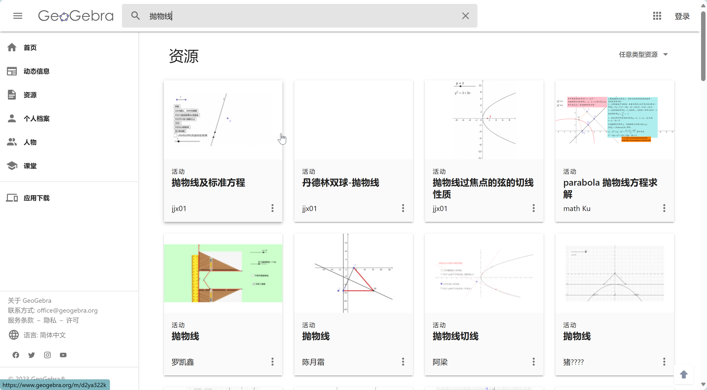

本文简要介绍一下如何使用 GeoGebra 绘制平面图形. 因为是可视化操作, 大多数操作都可以通过段鼠标点击来完成, 所以下面主要给出一些例子, 具体的功能不再介绍.

# GeoGebra 是什么
以下摘自于[GeoGebra官网](https://www.geogebra.org/about)
> GeoGebra 是一款适用于各级教育的动态数学软件, 它将**几何, 代数, 表格, 绘图, 统计和微积分**整合到一个引擎中. 此外, GeoGebra 还提供了一个**在线平台**, 其中包含由多语言社区创建的超过 **100 万**个免费课堂资源. 这些资源可以通过我们的协作平台 GeoGebra 教室轻松共享, 在那里可以实时监控学生的进度.
>
> GeoGebra 是一个拥有数**百万用户**的社区, 几乎分布在每个国家. 它已经成为**全球领先**的动态数学软件提供商, 支持科学, 技术, 工程和数学(STEM)教育以及教学创新. GeoGebra 的数学引擎以不同的方式, 从简单的演示到完整的在线评估系统, 为全球数百个教育网站提供动力.

# GeoGebra 的使用

## GeoGebra 经典
GeoGebra 同时提供[在线版本](https://www.geogebra.org)(Web端)和客户端. 不经常使用的话, 可以使用在线版本.
其主页如下

左上角提供了一些资源和教程等链接, 右上角可以登录账号, 下方是侧重点不同的应用的地址, 包括3D计算器, 几何, GeoGebra 经典等. 

> 建议注册一个账号, 方便把绘制的图像保存在账号中, 以备后续修改或使用, 也便于分享给其他人.

绘制平面图形通常使用[GeoGebra 经典](https://www.geogebra.org/classic), 其操作界面如下

- 左上方是工具栏, 可以移动画布, 然后是点, 线, 关系线, 多边形, 圆, 圆锥曲线, 角度, 对称, 文本等操作集合.
- 左侧显示画布上的元素列表, 同时还有输入框, 支持输入公式. 
- 中间部分是画布, 是绘制图形的容器.
- 右侧提供了**文件保存**, 导出, 视图等功能, 可以将绘制的图形**导出为图片**. 视图功能可以选择显示**代数区**, 绘图区等小窗口.

## 绘制图形

### 坐标轴和网格
画布默认显示坐标轴和辅助网格线. 可以右键取消.


### 使用工具栏绘图
GeoGebra 左上方工具栏提供了各种点线面的功能, 可以轻松绘制平面图形. 例如选择圆锥曲线工具栏, 点击椭圆, 左下角便会提示先选择两个焦点, 然后选择椭圆上的一个点, 这样就确定了一个椭圆曲线.


> 需要注意的是, 椭圆曲线绘制完成后, 如果不点击其它按钮, 此时画布仍然是绘制椭圆的环境, 可以继续选点绘制椭圆曲线. 

> 点击左上方工具栏第一个箭头按钮可以移动画布, 也可以移动画布上的所有元素. 鼠标滚轮可以对画布进行缩放. 点击右下角房子形状的按钮, 可以使原点居中. 双击画布上的元素, 可以修改其部分属性, 如坐标, 文本等.

### 元素属性
上面绘制椭圆以后, 左侧栏显示三个点的坐标和椭圆曲线的方程, 它们都是单独的元素或者对象, 可以分别设置它们的样式, 如点的大小, 颜色, 填充样式; 线的颜色, 粗细, 填充.
可以点击左侧栏元素框的左端圆圈将其隐藏, 或者鼠标右键元素框对其属性进行设置, 还可以双击元素框修改点的坐标等. 如下图所示


另外, 当画布上元素很多时, 我们也可以直接点击图形中的元素对其进行属性设置


> 每次添加添加新的元素都会显示它的标签, 通常来说, 这个标签不需要显示. 我们可以修改全局设置, 添加元素时不显示标签, 如下所示

 **全局设置**中还可以设置精度, 字号等.

### 输入表达式绘图
使用工具栏提供的操作绘图虽然比较方便, 但是不精确. 如果想要绘制精确的图形, 需要使用手动输入表达式来绘制图形. 熟练的话, 手动输入也会很快.
点击输入框之后, 会弹出一个符号面板, 可以点击面板上的函数或者键盘输入都可以. 注意, 如果把符号面板关闭, 可以点击左下角的键盘符号将其打开.


绘制显函数曲线

> 可以看到输入框支持只输入函数的右端(含$x$的表达式). 另外, 元素框左端圆圈的颜色对应曲线的颜色(颜色是随机分配的)

绘制隐函数曲线


### 滑动块
点击左上角工具栏倒数第二个按钮, 可以添加滑动块. 我们使用滑动块绘制椭圆上的点 $P$ 与焦点 $F_1,F_2$ 的连线随 $P$ 的运动而运动.


这里滑动块对应的变量名可以被引用, 因此我们用其定义 $P$ 点坐标. 然后又利用线段工具, 分别连接 $P$ 和两个焦点. 之后对滑动块开启动画即可.

### 标签
标签是绘图中不可缺少的. GeoGebra虽然会自动为各元素分配标签, 但是往往不是我们想要的. 因此我们通常将其自动生成的标签隐去, 使用 Geogebra 的文本按钮手动添加标签.


> 这里有两点需要注意. 首先是添加文本时, 要区分文字与数学符号或者数学公式. 视频中, 我们添加的 $F_1$ 和 F2显示是不同的. 数学符号或者公式显示为斜体. 如何输入数学公式我们后面再详细介绍. 另外一点是, $P$ 点是变动的, 因此其标签位置不能固定, 需要将标签位置坐标设置在 $P$ 的动态坐标附近.

> 双击添加的标签可以修改其内容, 也可以使用拖动功能移动标签的位置.

### LaTex 公式
添加标签时, 如果是数学符号或者公式, 需要点击 `LaTex公式`按钮. 下面是一些常用的 LaTex 公式对照表.
|输入|输出|
|:-|:-|
|a, P, F, Q|$a, P, F, Q$|
|a^2, A^2, A^{12}, A^{x+y}|$a^2, A^2, A^{12}, A^{x+y}$|
|a_1, A_1, A_{12}, A_{x+y}|$a_1, A_1, A_{12}, A_{x+y}$|
|a_1^2, a_{12}^{x+y}|$a_1^2, a_{12}^{x+y}$|
|\frac{3}{4}, \frac{x^2}{a^2}, \frac{3(x+y)}{4(x-y)}, a^{\frac{1}{3}}|$\frac{3}{4}, \frac{x^2}{a^2}, \frac{3(x+y)}{4(x-y)}, a^{\frac{1}{3}}$|
|\geq, <, >, \leq, =|$\geq, <, >, \leq, =$|
|\alpha, \beta, \gamma, \delta|$\alpha, \beta, \gamma, \delta$|
|a\in A, B\subset A|$a\in A, B\subset A$|
|\|AB\||$\|AB\|$|
|\sqrt{a+b}|$\sqrt{a + b}$|
|\overline{PQ}|$\overline{PQ}$|



还有一些辅助输入的网站, 如[latexlive](https://www.latexlive.com/##).

### 文件保存
前面我们已经提到, 图形绘制完成后, 可以通过右上角工具栏将其导出为图片. 这里一般不通过截图, 因为导出图片比截图更加清晰.
如果绘图中使用了滑动条, 并且图形是动图, 那么需要使用第三方录屏工具来保存图片, 因为 GeoGebra 不支持导出动图. 下面是一个第三方`gif`录制软件, 比较小巧好用.
另外, 也可以保存源文件(文件后缀为`.ggb`), 后续可以继续用GeoGebra打开并修改. 当然, 最方便的方法是注册一个账号, 在线保存即可.


# 一些例子
## 椭圆的离心率
可视化当椭圆逐渐变圆的过程中, 离心率 $e$ 的变化.

> 标签中的本文可以引用已经定义的变量, 会显示变量对应的数值.

## [心形曲线](https://www.bilibili.com/video/BV1PK411T7nC/)


## 双曲线


# 在线资源
GeoGebra首页资源中, 有非常多别人分享的图形. 首页搜索框可以直接搜索别人分享的绘图, 可以打开查看, 修改, 保存.

GeoGebra可以绘制很多复杂, 酷炫的图形和效果.


# 🧾 GeoGebra常用指令与绘图示例大全

> 本文由ChatGPT生成, 整理了GeoGebra中常用的基础与绘图指令，配合示例展示输入语法与可视化范围。  
> 适用于课堂教学、实验报告及数学演示。

---

## 📌 一、基础代数指令

### 1. 赋值与计算
```javascript
a = 3
b = 4
c = sqrt(a^2 + b^2)
```
**说明：** 计算直角三角形斜边长度。

---

### 2. 函数定义与计算
```javascript
f(x) = x^2 + 3x - 5
f(2)
```
**输出：** `5`

---

### 3. 解方程
```javascript
Solve(x^2 - 5x + 6 = 0)
```
**输出：** `{x = 2, x = 3}`

---

### 4. 极值与导数
```javascript
f(x) = x^3 - 3x^2 + 2
Derivative(f)
Extremum(f)
```
**说明：** 求函数导数与极值点。

---

## 📉 二、绘图与曲线命令

### 1. 绘制函数图像
```javascript
f = sin(x)
```
或者限制范围
```javascript
Function(f, -2π, 2π)
```
---

### 2. 参数曲线
```javascript
Curve(cos(t), sin(t), t, 0, 2π)
```
**说明：** 绘制单位圆。

---

### 3. 极坐标曲线
```javascript
Curve(r*cos(t), r*sin(t), t, 0, 2π)
```
**示例：**  
```javascript
r = 1 + 0.5*sin(5t)
Curve(r*cos(t), r*sin(t), t, 0, 2π)
```
**说明：** 五叶玫瑰线。

---

## 📊 三、几何作图指令

### 1. 点与线
```javascript
A = (0, 0)
B = (3, 2)
Line(A, B)
Segment(A, B)
```

---

### 2. 圆与多边形
```javascript
Circle(A, 2)
Polygon((0,0), (2,0), (1,2))
```

---

### 3. 垂线与平行线
```javascript
PerpendicularLine(A, Line(B, C))
ParallelLine(A, Line(B, C))
```

---

### 4. 交点
```javascript
Intersect(Line(A, B), Circle(A, 2))
```

---

## 🧮 四、分析与计算工具

### 1. 定积分
```javascript
Integral(f, 0, 2)
```

### 2. 数列与表格
```javascript
Sequence(n^2, n, 1, 10)
```

### 3. 统计与拟合
```javascript
List1 = {1, 2, 3, 4, 5}
List2 = {2, 3, 5, 7, 11}
FitLine(List1, List2)
```

---

## 🧭 五、动画与动态演示

### 1. 动点
```javascript
A = (cos(t), sin(t))
```
**说明：** 将t设置为滑块，A沿圆周运动。

---

### 2. 旋转与平移
```javascript
Rotate(Polygon((0,0), (1,0), (0,1)), 45°)
Translate(A, (2, 1))
```

---

## 🧠 六、其他实用命令

| 功能 | 指令示例 | 说明 |
|------|-----------|------|
| 隐函数图像 | `ImplicitPlot(x^2 + y^2 = 1)` | 画出圆 |
| 向量表示 | `Vector((0,0),(2,1))` | 定义向量 |
| 单位向量 | `UnitVector((3,4))` | 归一化 |
| 角度计算 | `Angle(A, B, C)` | 计算∠ABC |
| 数值显示 | `Value(f(1.5))` | 输出函数值 |

---

## 📘 七、示例：综合演示

```javascript
f(x) = sin(x)
g(x) = cos(x)
A = (π/4, f(π/4))
B = (π/4, g(π/4))
Polygon((0,0), A, B)
```
**说明：** 同时绘制sin与cos曲线，并作出特定区间内的三角形演示。

**绘制曲线围成的区域: 分割计算面积**
```javascript
x = 1
n = 100
Sequence[ Polygon[{ (0 + i*x/n, 0), (0 + i*x/n, (0 + i*x/n)^2), (0 + (i+1)*x/n, (0 + i*x/n)^2), (0 + (i+1)*x/n, 0) }], i, 0, n-1 ]
```

---

## ✅ 附录：常见快捷指令

| 类别 | 指令 | 功能说明 |
|------|------|-----------|
| 代数 | `Simplify(expr)` | 化简表达式 |
| 代数 | `Expand(expr)` | 展开表达式 |
| 微积分 | `Derivative(f, x)` | 对f求导 |
| 微积分 | `Integral(f, a, b)` | 求定积分 |
| 数列 | `Sequence(expr, var, start, end)` | 生成序列 |
| 几何 | `Polygon(P1, P2, …)` | 绘制多边形 |
| 函数绘图 | `Plot(f, a, b)` | 绘制f在[a,b]上的曲线 |

---

> 📎 **说明：** 所有示例均可在GeoGebra网页版或桌面版直接输入运行。  
> 推荐：使用滑块(`Slider`)动态控制参数，实现交互式教学效果。



