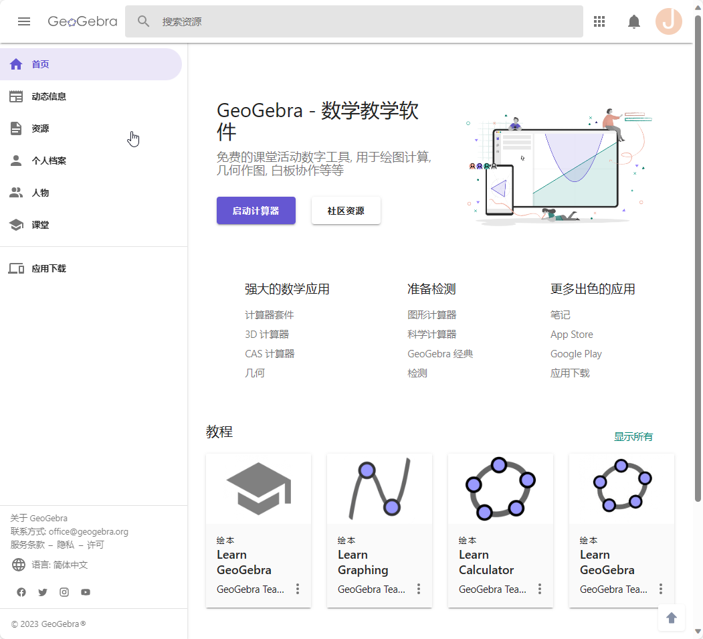
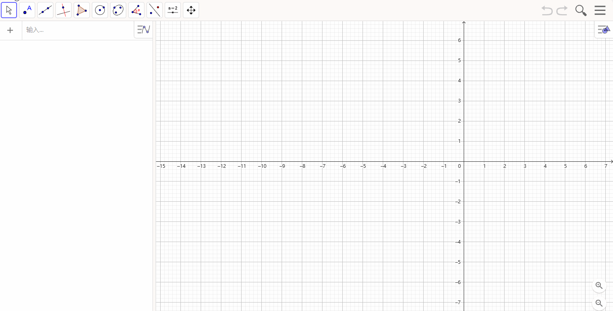
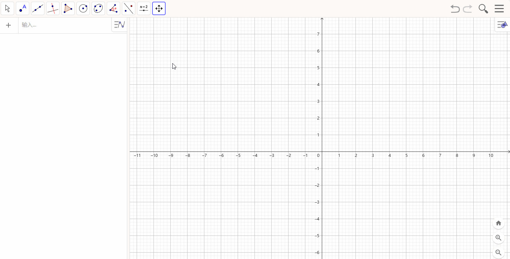
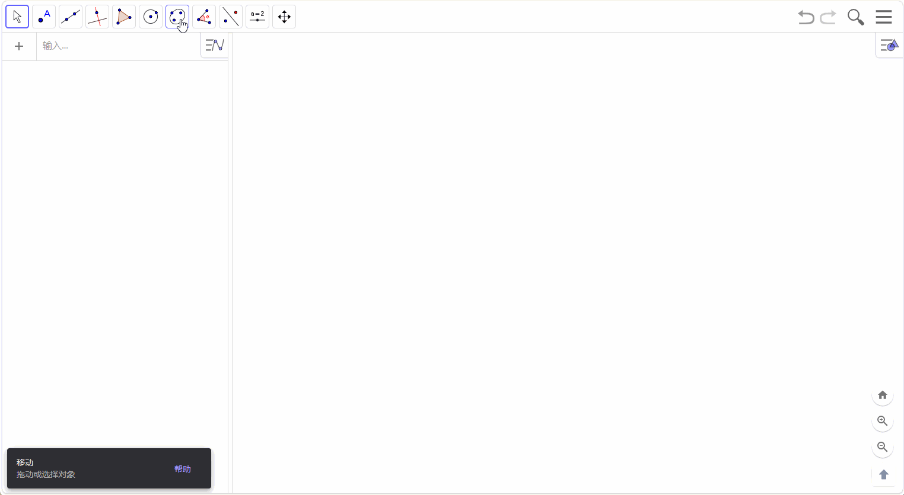
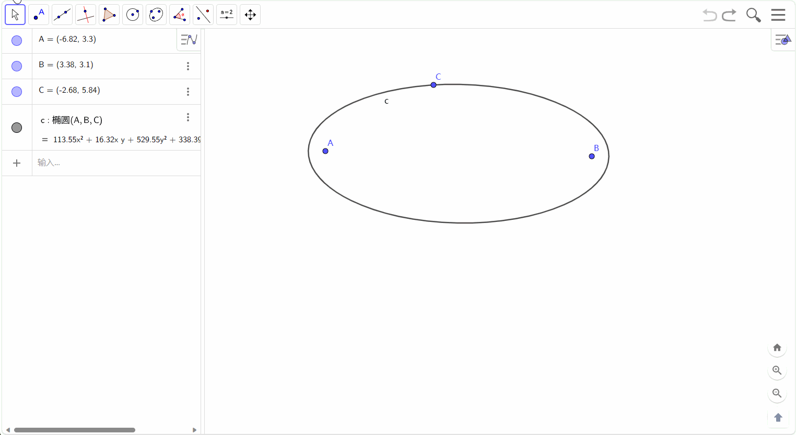
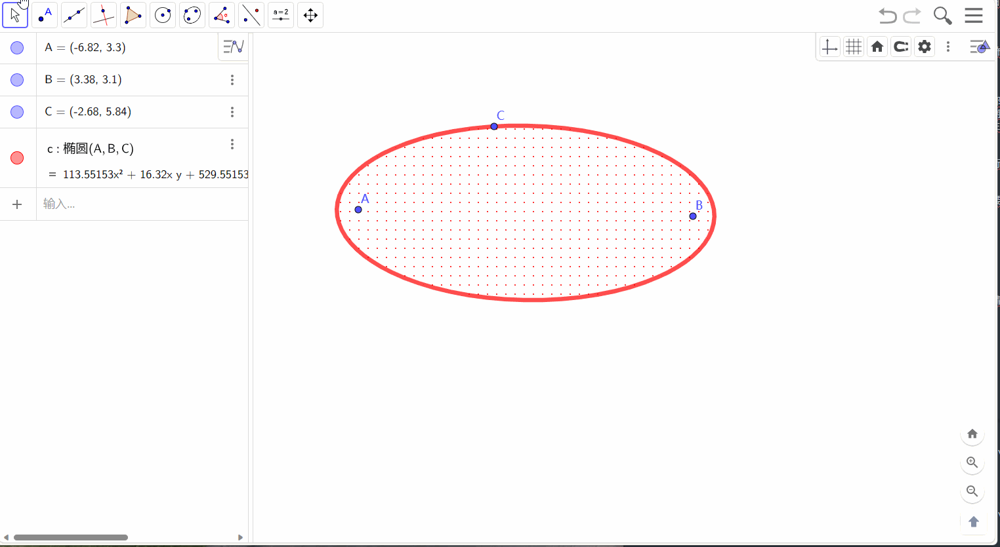
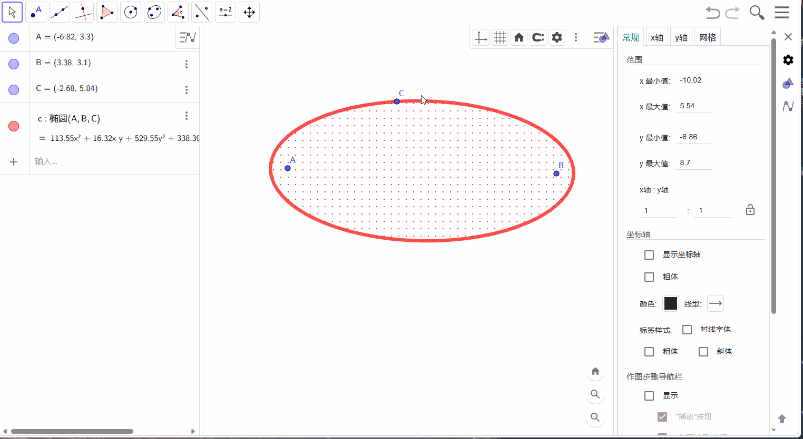
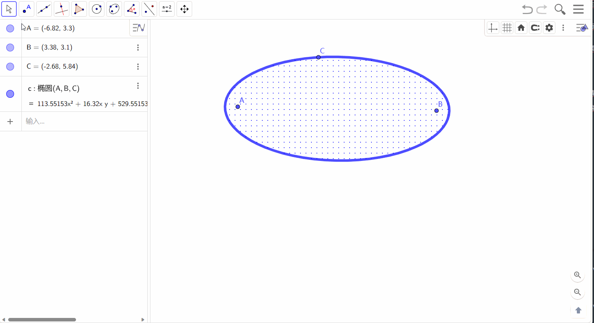
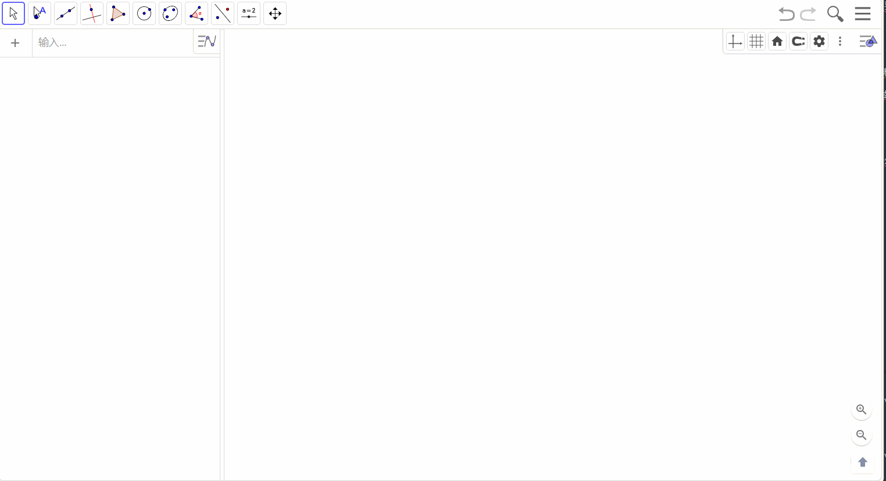



本文简要介绍一下如何使用 GeoGebra 绘制平面图形. 因为是可视化操作, 大多数操作都可以通过拖拽来完成, 所以主要给出一些例子, 具体的功能不再介绍.

# GeoGebra 是什么
以下摘自于[GeoGebra官网](https://www.geogebra.org/about)
> GeoGebra 是一款适用于各级教育的动态数学软件, 它将**几何, 代数, 表格, 绘图, 统计和微积分**整合到一个引擎中. 此外, GeoGebra 还提供了一个**在线平台**, 其中包含由多语言社区创建的超过 **100 万**个免费课堂资源. 这些资源可以通过我们的协作平台 GeoGebra 教室轻松共享, 在那里可以实时监控学生的进度.
>
> GeoGebra 是一个拥有数**百万用户**的社区, 几乎分布在每个国家. 它已经成为**全球领先**的动态数学软件提供商, 支持科学, 技术, 工程和数学(STEM)教育以及教学创新. GeoGebra 的数学引擎以不同的方式, 从简单的演示到完整的在线评估系统, 为全球数百个教育网站提供动力.

# 简单使用

## 获取软件
GeoGebra 同时提供[在线版本](https://www.geogebra.org)(Web端)和客户端. 不经常使用的话, 可以使用在线版本.
其主页如下

左上角提供了一些资源和教程等链接, 右上角可以登录账号, 下方是侧重点不同的应用的地址, 包括3D计算器, 几何, GeoGebra 经典等. 

> 建议注册一个账号, 方便把绘制的图像保存在账号中, 以备后续修改或使用, 也便于分享给其他人.

## GeoGebra 经典
绘制平面图形通常使用[GeoGebra 经典](https://www.geogebra.org/classic), 其操作界面如下

- 左上方是工具栏, 可以移动画布, 然后是点, 线, 关系线, 多边形, 圆, 圆锥曲线, 角度, 对称, 文本等操作集合.
- 左侧显示画布上的对象列表, 同时还有要给输入框, 支持输入公式. 
- 中间部分是画布, 是绘制图形的容器.
- 右侧提供了文件保存, 导出, 视图等功能.

## 绘制图形

### 坐标轴和网格
画布默认显示坐标轴和辅助网格线. 可以右键取消.

### 使用工具栏绘图
GeoGebra 左上方工具栏提供了各种点线面的功能, 可以轻松绘制平面图形. 例如选择圆锥曲线工具栏, 点击椭圆, 左下角便会提示先选择两个焦点, 然后选择椭圆上的一个点, 这样就确定了一个椭圆曲线.

> 需要注意的是, 椭圆曲线绘制完成后, 如果不点击其它按钮, 此时画布仍然是绘制椭圆的环境, 可以继续选点绘制椭圆曲线. 

> 点击左上方工具栏第一个箭头按钮可以移动画布, 鼠标滚轮可以对画布进行缩放, 点击右下角房子形状的按钮, 可以使原点居中.

### 元素属性
上面绘制椭圆以后, 左侧栏显示三个点的坐标和椭圆曲线的方程, 它们都是单独的元素或者对象, 可以分别设置它们的样式, 如点的大小, 颜色, 填充样式; 线的颜色, 粗细, 填充.
可以点击左侧栏每个元素的左端圆圈将其隐藏, 或者点击元素框对其属性进行设置. 如下图所示

另外, 当画布上元素很多时, 我们也可以直接点击图形中的元素对其进行属性设置

> 每次添加添加新的元素都会显示它的标签, 通常来说, 这个标签不需要显示. 我们可以修改全局设置, 添加元素时不显示标签, 如下所示

 **全局设置**中还可以设置精度, 字号等.

### 输入表达式绘图
使用工具栏提供的操作绘图虽然比较方便, 但是不精确. 如果想要绘制精确的图形, 需要使用手动输入表达式来绘制图形.
点击输入框之后, 会弹出一个符号面板, 可以点击面板上的函数或者键盘输入都可以. 注意, 如果把符号面板关闭, 可以点击左下角的键盘符号将其打开.

绘制显函数曲线

> 可以看到输入框支持只输入函数的右端(含$x$的表达式). 另外, 元素框左端圆圈的颜色对应曲线的颜色(颜色是随机分配的)

绘制隐函数曲线

### 滑动块
点击左上角工具栏倒数第二个按钮, 可以添加滑动块. 我们使用滑动块绘制椭圆上的点 $P$ 与焦点 $F_1,F_2$ 的连线随 $P$ 的运动而运动.


这里滑动块对应的变量名可以被引用, 因此我们用其定义 $P$ 点坐标. 然后又利用线段工具, 分别连接 $P$ 和两个焦点. 之后对滑动块开启动画即可.

### 标签
标签是绘图中不可缺少的. GeoGebra虽然会自动为各元素分配标签, 但是往往不是我们想要的. 因此我们通常将其自动生成的标签隐去, 使用 Geogebra 的文本按钮手动添加标签.


> 这里有两点需要注意. 首先是添加文本时, 要区分文字与数学符号或者数学公式. 视频中, 我们添加的 $F_1$ 和 F2显示是不同的. 数学符号或者公式显示为斜体. 如何输入数学公式我们后面再详细介绍. 另外一点是, $P$ 点是变动的, 因此其标签位置不能固定, 需要将其位置坐标设置在 $P$ 的动态坐标附近.

### LaTex 公式
添加标签时, 如果是数学符号或者公式, 需要点击 `LaTex公式`按钮. 下面是一些常用的 LaTex 公式对照表.
|输入|输出|
|:-|:-|
|a, P, F, Q|$a, P, F, Q$|
|a^2, A^2, A^{12}, A^{x+y}|$a^2, A^2, A^{12}, A^{x+y}$|
|a_1, A_1, A_{12}, A_{x+y}|$a_1, A_1, A_{12}, A_{x+y}$|
|a_1^2, a_{12}^{x+y}|$a_1^2, a_{12}^{x+y}$|
|\frac{3}{4}, \frac{x^2}{a^2}, \frac{3(x+y)}{4(x-y)}|$\frac{3}{4}, \frac{x^2}{a^2}, \frac{3(x+y)}{4(x-y)}$|
|\geq, <, >, \leq, =|$\geq, <, >, \leq, =$|
|\alpha, \beta, \gamma, \delta|$\alpha, \beta, \gamma, \delta$|
|a\in A, B\subset A|$a\in A, B\subset A$|
|\|AB\||$\|AB\|$|
|\sqrt{a+b}|$\sqrt{a + b}$|



# 一些例子
## 椭圆的离心率
可视化当椭圆逐渐变圆的过程中, 离心率 $e$ 的变化.


# 在线资源

