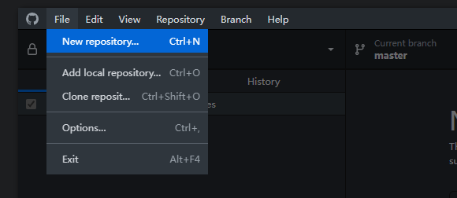
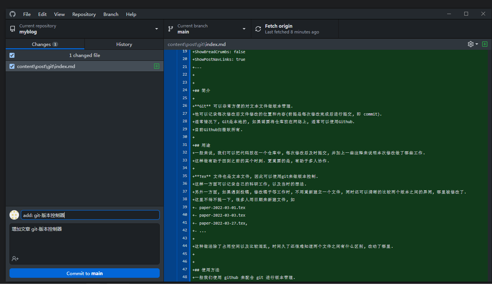
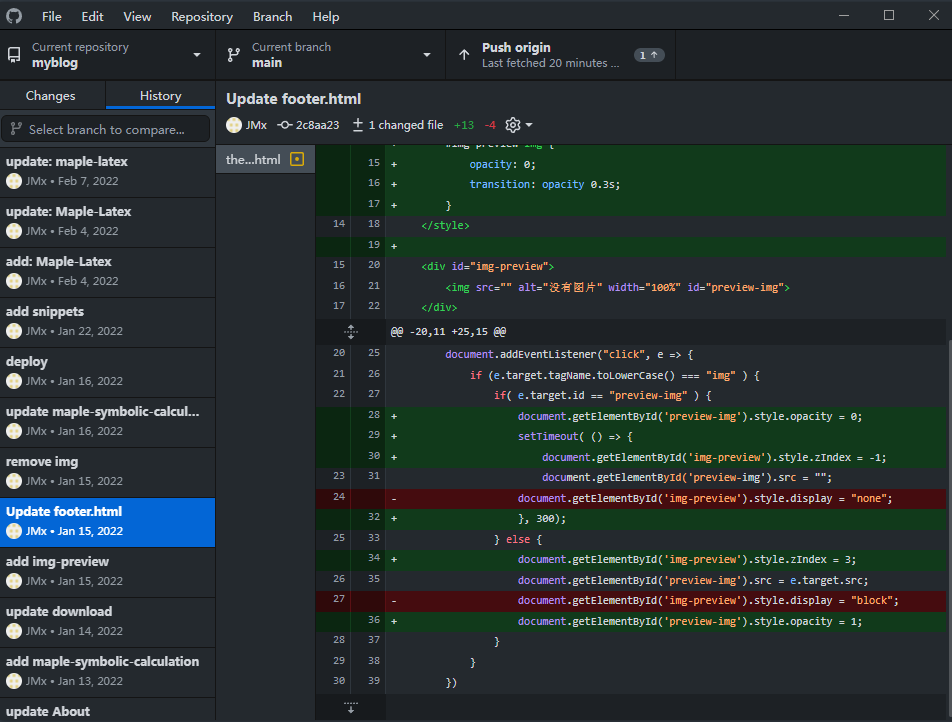

## 简介

**Git** 可以非常方便的对文本文件做版本管理. 
他可以记录每次修改后文件修改的位置和内容(前提是每次修改完成后进行提交, 即 commit). 
通常情况下, Git是本地的, 如果需要将仓库放在网络上, 通常可以使用Github.
目前Github归微软所有.

## 用途
一般来说, 我们可以把代码放在一个仓库中, 每次修改后及时提交, 并加上一些注释来说明本次修改做了哪些工作.
这样做有助于回到之前的某个时刻. 更重要的是, 有助于多人协作.

**Tex** 文件也是文本文件, 因此可以使用git来做版本控制. 
这样一方面可以记录自己的科研工作, 以及当时的想法.
另外一方面, 如果遇到投稿, 修改稿子等工作时, 不用重新建立一个文件, 同时还可以清晰的比较两个版本之间的异同, 哪里被修改了.
这里不得不提一下, 很多人用日期来新建文件, 如
- paper-2022-03-01.tex
- paper-2022-03-03.tex
- paper-2022-03-27.tex, 
- ...

这种做法除了占用空间以及比较混乱, 时间久了还很难知道两个文件之间有什么区别, 改动了哪里.


## 使用方法
一般我们使用 github 来配合 git 进行版本管理. 
因此, 我们需要下载[ git ](https://git-scm.com/download/)和[ github desktop ](https://desktop.github.com/). 
同时需要注册一个 github 账号来使用 github. 

之后使用 github 新建一个仓库 ```new repository```, 选择一个空的文件夹, 并起一个仓库名, 如 ```test```.
github 会初始化一个 git 仓库, 里面有一个 ```git``` 文件夹. 

然后就可以把需要做版本控制的文件放在 ```test/``` 文件夹下. 此时回到 github, 会看到提示增加了一个文件(如果是修改, 则会提示修改, 并突出显示修改了哪些地方).

左下角有一个 commit 按钮, 填写一个此次提交的 summary (简单介绍干了啥), 具体的一些工作内容以及想法可以写在 description 中.
然后点击 commit 即可提交. 

提交以后, github 会提示是否需要同步到网络, 即 push. 
此功能可以将本地仓库同步到 github 账号, 随时随地都可以下载, 进行查看, 修改和同步.
例如在工作室提交并同步以后, 回到家里面, 可以从网络仓库拉取到本地, 即 pull.
此时同样可以查看提交历史, 修改, 提交, 同步等.

> 需要注意的是, 国内访问 github 不太稳定, 经常打不开. 
可以使用[网易uu加速器](https://uu.163.com)来加速访问.

以下是一些图例:

- 创建仓库

- 提交

- 查看版本

左侧显示提交历史, 右侧可以查看每次提交是修改了哪些文件以及各个文件修改了哪里.

## 常用命令
### rebase
有时候完成某一点的修改, 中间提交了多次, 我们可以把它们合并成一次 commit. 
这需要在git 命令行中输入(以最近的4次提交合并成一个为例)
```bat
git rebase -i HEAD~4 
```
此时会打开一个窗口, 用来完成此次合并, 其内容为
```bat
pick 70d651c update: maple-latex # 倒数第四个
pick 8ef0aa9 update: maple-latex
pick a96ed9e update: maple-latex
pick 2cfc89e update: maple-latex # 最新的

# Rebase a7d2d47..2cfc89e onto a7d2d47 (4 commands)
# ...
```
里面会显示最近四次提交的 summary.
因为四次提交做的是同一件事(当然, 每次提交都是在前一版本上做修改, 而且可能有不同的 description ), 所以我们可以把
最新的三次提交合并到倒数第四次, 将四次提交变成一次.
我们需要修改上述文件为
```bat
pick 70d651c update: maple-latex # 倒数第四个
s 8ef0aa9 update: maple-latex
s a96ed9e update: maple-latex
s 2cfc89e update: maple-latex # 最新的

# Rebase a7d2d47..2cfc89e onto a7d2d47 (4 commands)
# ...
```
这里的 pick 表示保留该 commit, 而 s(squash) 则表示将此次 commit 合并到前一个 commit. 
需要注意的是, 这四次提交合并的时候可能会出现冲突, 此时回到 github, 它会有一个弹窗, 告诉你哪些文件在合并的时候出现了冲突.
我们需要手动解决冲突, 一般来说选择最新的文件即可 (commit ... in ...).

### pull request && fetch upstream
这两个功能出现在多人协作中.
当我们Fork别人的代码进行修改, 提交到自己的仓库. 然后可以提Pull Request (PR), 等待原仓库作者审阅, 合并. 如果在修改过程中, 原仓库有了新的提交, 如果需要更新Fork过来的仓库, 可以使用fetch upstream功能. 

正常情况下, Github会给Fork的仓库上面提示和原仓库多了几次提交, 少了几次提交

对于多的, 我们可以Pull Request. 如果少了, 可以fetch upstream. 后者对于某些文件可能会出现冲突, 时我们可以根据github提示, 使用命令行工具进行修改. 

在解决冲突文件时, 文件中会有如下的符号
<<<<< HEAD
这一部分是我们自己的修改
== = = = 
这一部分是原作者的修改
\> \> b... 
对这一部分内容保留想要的即可解决冲突.


