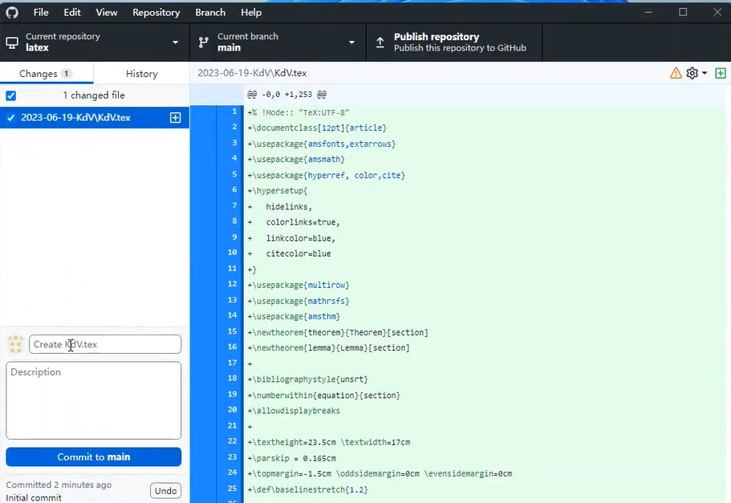
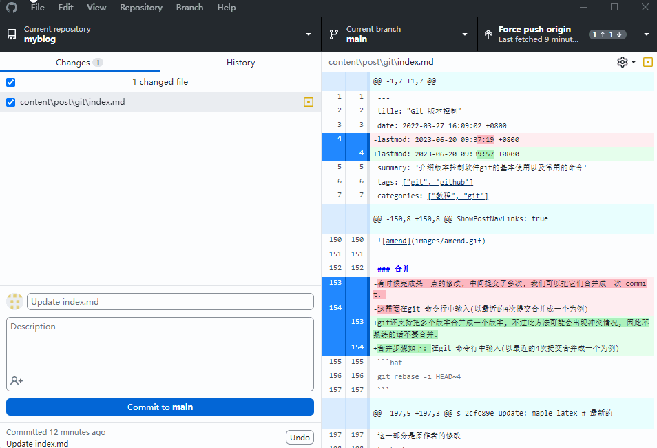

## 简介

**Git** 可以非常方便的对文本文件做版本管理. 
他可以记录每次修改后文件修改的位置和内容(前提是每次修改完成后进行提交, 即 commit). 
通常情况下, Git是本地的, 界面不好看. 如果需要将仓库放在网络上, 通常可以使用Github.
目前Github归微软所有.

## 用途
一般来说, 我们可以把代码放在一个仓库(即一个文件夹)中, 每次修改后及时提交, 并加上一些注释来说明本次修改做了哪些工作.
这样做有助于回到之前的某个时刻. 更重要的是, 有助于多人协作.

**Tex** 文件也是文本文件, 因此可以使用git来做版本控制. 
这样一方面可以记录自己的科研工作, 以及当时的想法.
另外一方面, 如果遇到投稿, 修改稿子等工作时, 不用重新建立一个文件, 同时还可以清晰的比较两个版本之间的异同, 哪里被修改了.
这里不得不提一下, 很多人用日期来新建文件, 如
- paper-2022-03-01.tex
- paper-2022-03-03.tex
- paper-2022-03-27.tex, 
- ...

这种做法除了占用空间以及比较混乱, 时间久了还很难知道两个文件之间有什么区别, 改动了哪里.


## 使用方法
一般我们使用 github 来配合 git 进行版本管理. 
因此, 我们需要下载[ git ](https://git-scm.com/download/)和[ github desktop ](https://desktop.github.com/). 
前者是版本控制工具, 选择合适的系统下载软件, 然后按照默认设置安装即可.

后者提供一个好看的界面, 下载安装即可使用, 后面我们主要是利用它来进行版本控制.
具体使用如下:
- **创建账号**

两种方式, 一种是注册一个github网络账号, 这种方式可以把仓库同步到网络.
另一种是跳过此步, 注册一个本地账号.
我们选择第二种

输入昵称和邮箱即可.
- **创建仓库**

创建账号以后, 就会进入创建仓库界面, 点击第二个按钮, 在本地创建新的仓库

我们创建一个名为`latex`的仓库, 为了方便演示, 将其放在桌面. 点击创建, 即可在桌面生成一个名为`latex`的文件夹

里面有一个默认的文件`.gitattributes`和文件夹`.git`.
部分电脑如果没有设置, 此文件夹会被隐藏. 它里面放的就是版本控制的信息, 因此不能删除.
这样我们的仓库就创建完成, 可以把需要做版本控制的文件或者文件夹复制进来.
- **添加文件**

我们创建一个关于KdV方程的论文的文件夹, 将tex文件放在里面. 
然后打开github desktop软件, 可以看到

界面左侧上方显示的是发生变动的文件. 当然也有可能多个文件发生了变动, 变动的文件名前面有一个复选框.
下面示例中

有6个文件发生了变动, 右侧黄色框表示修改, 绿色框表示添加, 红色框表示删除.
下方显示两个文本框和一个提交按钮.
第一个文本框是必填项, 称为提交信息, 字数有限制.
添加文件默认是`Create ...`, 修改文件默认是`Update ...`, 删除文件默认是`Delete ...`. 
可以根据变动自行填写.
第二个文本框可选, 称为提交描述, 无字数限制.
可以用来说明修改了什么, 谁做了修改, 为什么做修改等等.
填完两个文本框以后, 就可以提交本次修改. 这里可以勾选某个文件不做提交. 
比如修改了两个文件, 目的不同, 想要分别提交, 就可以一次选择一个文件提交.
一次提交对应于仓库的一个版本.
界面右侧显示文件修改了哪里, 具体到哪一行.

上图是一个示例, 修改的地方会高亮. 其中粉红色部分表示删除的(老的), 行首有一个减号. 浅蓝色部分表示添加的(新的), 行首有一个加号. 两个箭头之间(如151-171行之间)表示折叠, 这一部分没有发生变动.
注意, 为了使变动的部分看起来方便, 一定要多换行(如句号后换行), 否则, 不容易对比.
- **历史版本**
接下来, 我们修改`KdV.tex`并保存, 此时github desktop界面如下

填写提交信息以后, 点击提交. 在历史版本(Hirtory)中查看

可以看到这个仓库(文件夹)已经有三个版本, 第一个版本是我们创建仓库的时候软件默认提交.
第二个版本是添加KdV文件时提交, 第三个版本是更改KdV文件时提交.
点击相应的版本, 就可以看到变动的文件和它在上一个版本中的对比.
如果我们想要回到仓库的某个版本, 可以利用分支来得到.
右键想要回到的版本, 点击`create branch from commit`, 可以生成一个分支(原来的称为主支, main), 该分支中的文件会回退到此版本.
而切换到主支, 仓库又会回到最新的版本.
如下所示


- **完整操作视频**


> 可以把所有的tex文件夹都放在latex仓库中, 方便管理. 当然, 每个tex最好单独放在一个子文件夹中. 全放在一个文件夹, 运行完太乱了.

> git 可以通过添加`.gitignore`文件来忽略对特定类型的文件或者文件夹不做版本控制. 由于tex文件编译后, 会生成很多临时文件和pdf文件, 这些文件是没有必要做版本控制的, 特别是pdf文件等非文本文件, git不支持对他们做对比, 只会增加仓库的大小. 针对tex类型仓库的gitignore文件内容为
```text
# latex
*.pdf
*.fls
*.gz
*.log
*.aux
*.out
*.dvi
*.bbl
*.blg
*.glo
*.gls
*.ind
*.inx
*.toc
*.sav
*.lof
*.tmp
*.out.bak
*.nav
*.snm
*.synctex.gz(busy)
*.synctex(busy)
*.gz(busy)
*.fdb_latexmk
*.xdv
```

下载以后, 把它复制到latex文件夹中, 然后提交即可. 


## 其它命令

### 修补
如果对仓库某个文件做了很小的修改, 觉得没有必要单独创建一个新的版本, 可以将改动追加到上一个版本. 只需要右键最新的版本, 点击`Amend commit`就可以重新提交, 可以修改提交信息和提交描述.


### 合并
git还支持把多个版本合并成一个版本, 不过此方法可能会出现冲突情况, 因此不熟练的话不要合并.
合并步骤如下: 在git 命令行中输入(以最近的4次提交合并成一个为例)
```bat
git rebase -i HEAD~4 
```
此时会打开一个窗口, 用来完成此次合并, 其内容为
```bat
pick 70d651c update: maple-latex # 倒数第四个
pick 8ef0aa9 update: maple-latex
pick a96ed9e update: maple-latex
pick 2cfc89e update: maple-latex # 最新的

# Rebase a7d2d47..2cfc89e onto a7d2d47 (4 commands)
# ...
```
里面会显示最近四次提交的 summary.
因为四次提交做的是同一件事(当然, 每次提交都是在前一版本上做修改, 而且可能有不同的 description ), 所以我们可以把
最新的三次提交合并到倒数第四次, 将四次提交变成一次.
我们需要修改上述文件为
```bat
pick 70d651c update: maple-latex # 倒数第四个
s 8ef0aa9 update: maple-latex
s a96ed9e update: maple-latex
s 2cfc89e update: maple-latex # 最新的

# Rebase a7d2d47..2cfc89e onto a7d2d47 (4 commands)
# ...
```
这里的 pick 表示保留该 commit, 而 s(squash) 则表示将此次 commit 合并到前一个 commit. 
需要注意的是, 这四次提交合并的时候可能会出现冲突, 此时回到 github, 它会有一个弹窗, 告诉你哪些文件在合并的时候出现了冲突.
我们需要手动解决冲突, 一般来说选择最新的文件即可 (commit ... in ...).

### pull request && fetch upstream
这两个功能出现在多人协作中.
当我们Fork别人的代码进行修改, 提交到自己的仓库. 然后可以提Pull Request (PR), 等待原仓库作者审阅, 合并. 如果在修改过程中, 原仓库有了新的提交, 如果需要更新Fork过来的仓库, 可以使用fetch upstream功能. 

正常情况下, Github会给Fork的仓库上面提示和原仓库多了几次提交, 少了几次提交

对于多的, 我们可以Pull Request. 如果少了, 可以fetch upstream. 后者对于某些文件可能会出现冲突, 时我们可以根据github提示, 使用命令行工具进行修改. 

在解决冲突文件时, 文件中会有如下的符号
<<<<< HEAD
这一部分是我们自己的修改
== = = = 
这一部分是原作者的修改
\> \> b... 
对这一部分内容保留想要的即可解决冲突.