

这里是 [maple-latex](https://jiandandaoxingfu.github.io/maple-latex) 的使用文档.

使用过程中如果出现错误，可以把相应的tex代码和错误描述
发送至: jiaminxin@outlook.com。 或者到项目[maple-latex](https://github.com/jiandandaoxingfu/maple-latex)提issue。

## 简介
Maple-Latex 主要用来处理符号运算中， 
Maple, Mathematics, Tex三者之间数学公式的转化。
整体界面如下:

其中左侧为按钮区和输入区, 右侧为显示区.

它的[最初版本](https://jiandandaoxingfu.github.io/maple-latex-version0/)是2018年1月24日制作的, 只涉及一些数学符号的GUI输入. 
当时的想法是把tex中的数学符号用mathjax显示在网页上, 这样手机也可以写一些简单的数学公式, 虽然没啥用.
当初还不知道 github 可以部署静态页面, 所以那时候是通过文件传输弄到手机或者电脑上, 本地使用.
而且当时代码水平也一般, 所以做的很简陋.
几年过去, 现在的功能早已和最初的想法无关, 但是这个项目的功能越来越多.
这些功能都是根据科研过程中自己或者其他人遇到的一些有关tex, maple, mma的需求引入的, 为科研提供了便利. 

> 注意, 处理 Maple生成的tex代码(经`latex`函数生成), 仅针对 Maple 18 (2014年2月10日) 版本. 对于更早的版本, 未测试. 对于更新的版本, 如 Maple 2023, `latex` 函数生成的tex代码与Maple 18不一致, 这样就导致本应用的一些功能可能不适用.

## 功能

### 使用说明
略

### 时间轴
记录了更改历史.

### 创建矩阵
可视化创建Tex矩阵/列表，生成相应代码.
默认生成 $3\times 4$ 矩阵 (最大不超过 10 阶). 
选中补零选项, 则没有值的位置自动补 $0$. 
小窗口左下角会有当前元素的预览
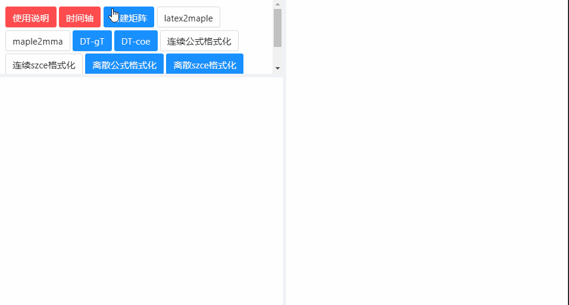

### Excel转列表
复制Excel表格中的数据， 转为Tex列表. 
> 不再维护

### latex2maple
此功能通常用来把论文中的公式转换成 maple 中的表达式, 提高效率.
使用步骤如下: 首先使用 mathpix snipping tool 识别 PDF 文件或图片中的数学公式，然后将其生成的 Tex 代码复制到输入框，点击按钮即可将Tex代码转成相应的Maple程序。 

> 注意, 如果tex代码不是通过mathpix-snipping-tool生成, 可能会转换失败. 因为每个人书写习惯不同, 情况太多, 不好处理.

此程序主要做如下工作:
|功能|目的|
|:-|:-|
|去除 tex 环境 |  如`\begin{equation}...\end{equation}`, 换行符 `\\`, `\left, \right`等.|
|导数转化 |  如 `u_{xxx}` 转化为 `diff(u, x$3)`. 需要注意的是, 这里需要提前在程序中定义 `alias(u=u(x))`.|
|积分转化 |  如 `\int u d x` 转化为 `int(u, x)`. 需要注意的是, 这里需要提前在程序中定义 `alias(u=u(x))`.|
|位移转化 |  如 `u^{+++}` 转化为 `shift(u, 3)`. 同样需要注意, 需要提前定义`alias(u=u(n))`.|
|上/下标转化 |  如 `alpha_1` 转化为 `alpha[1]`, 其在 maple 中显示为 $\alpha_1$. `s^{2x + t}` 转化为 `s^(2 x + t)`. 因此, 对于太复杂的公式, 可能并不适用.|
|分式转化 |  如 `\frac{a}{b}` 转化为 `a / b`.|
|函数转化 | 默认把 $e^k$ 中的 $e$ 转化为 $\exp$ 函数, $\ln$ 函数转化为 $\log$ 函数.|

下面是一些例子
- 单行公式
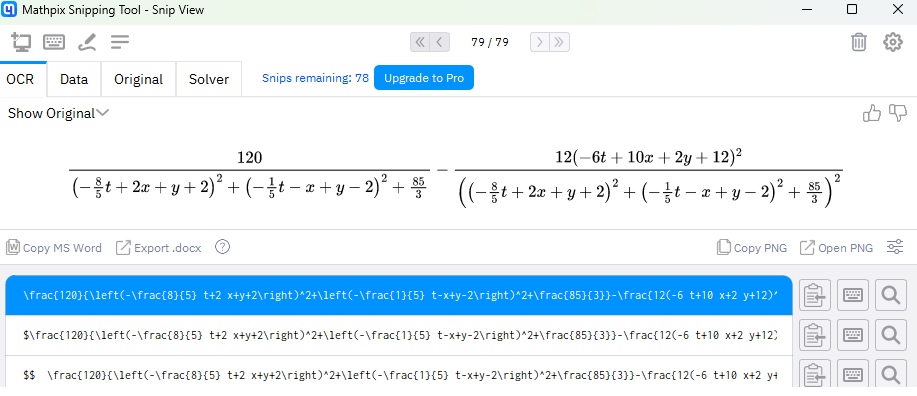
复制 tex 到输入框, 点击转换以后, 生成的结果(上面是原结果, 下面是转化结果)
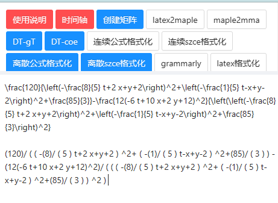
将转化结果复制到 maple 中的运行结果
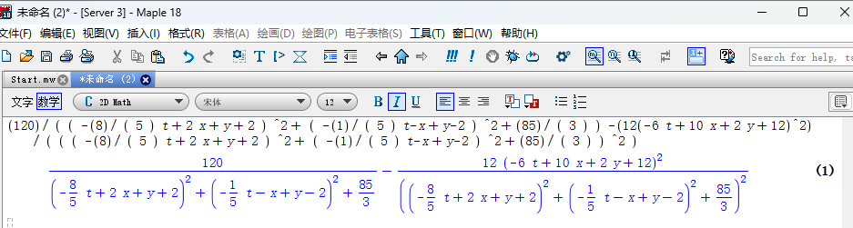

- 多行公式
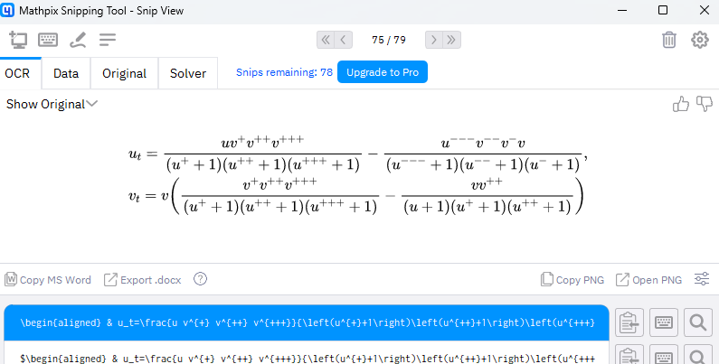
注意, 这里多行公式, 我们用逗号隔开, 即转化成序列.
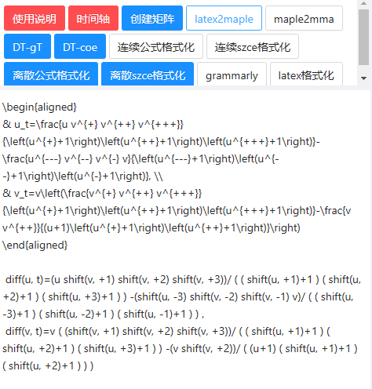
注意, 这里需要使用 `alias` 来定义 $u, v$, 另外还有位移函数 `shift`.
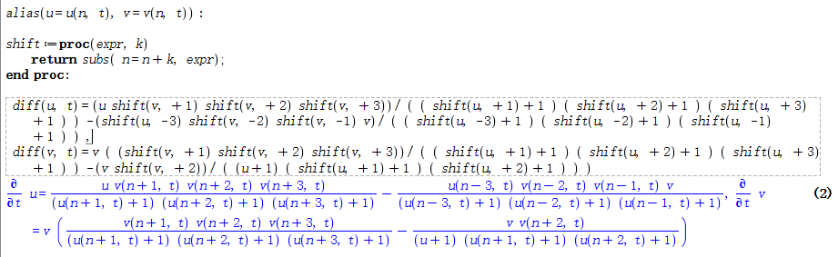

- 矩阵
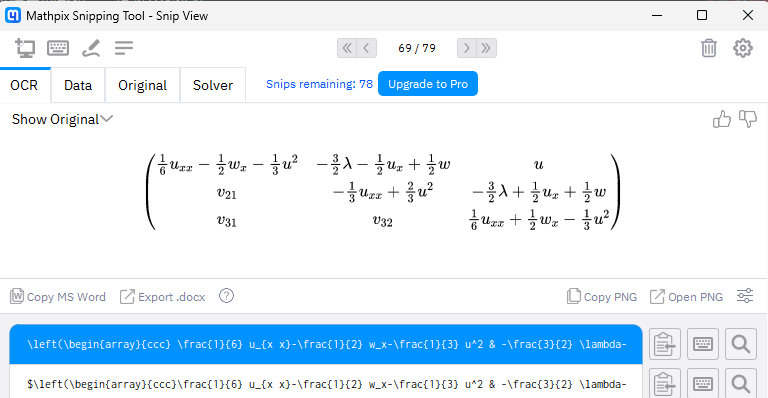
注意, 这里的矩阵, 我们仍然用逗号将每个元素隔开, 依然转化成序列.
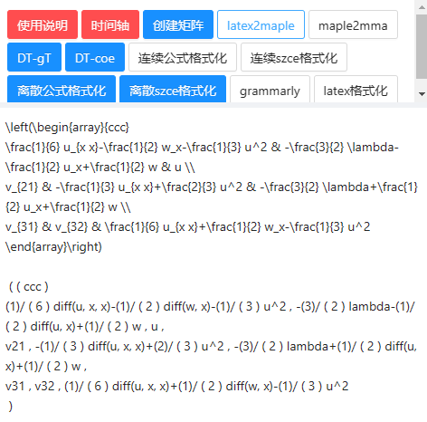
这里有几个需要注意的地方. 首先需要使用 `alias` 来定义 $u, w$. 
另外, 由于我们只把 `\left` 和 `\right` 删除, 因此整个环境还被 `()` 包裹, 复制的时候要扔掉多余的括号. 这里的 `(ccc)` 我们也没有删除, 程序还需要优化, 不过不影响结果.
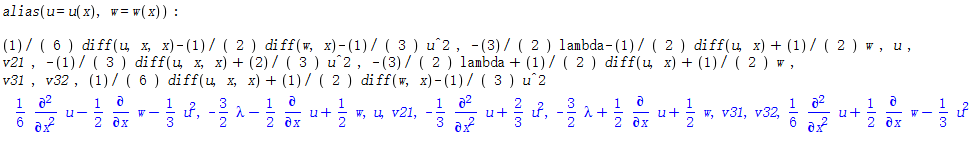

- 分式和上下标
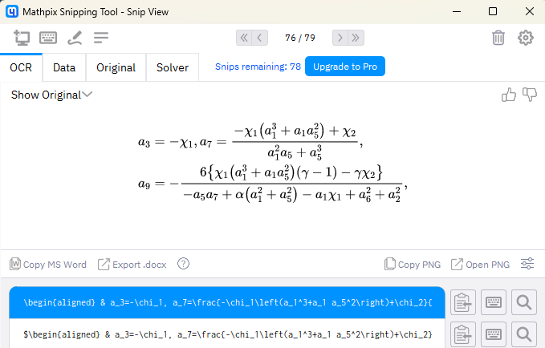
转化
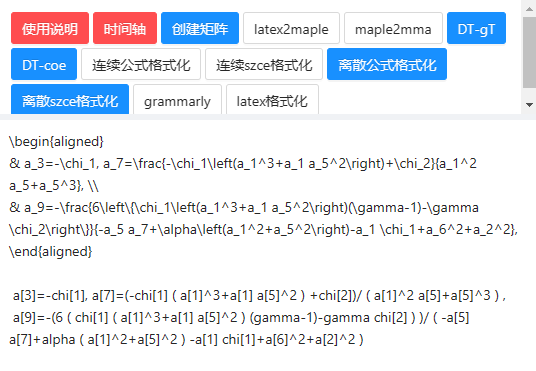
结果
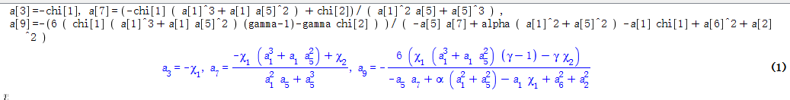

- 虚数单位
$$ $$
对于
$$e^{(2i x + 3 it + 4)},$$
会转化成
`exp((2 i x+3 i t+4))`, 因此需要提前定义 $i$.
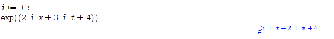

下面是一个完整的示例
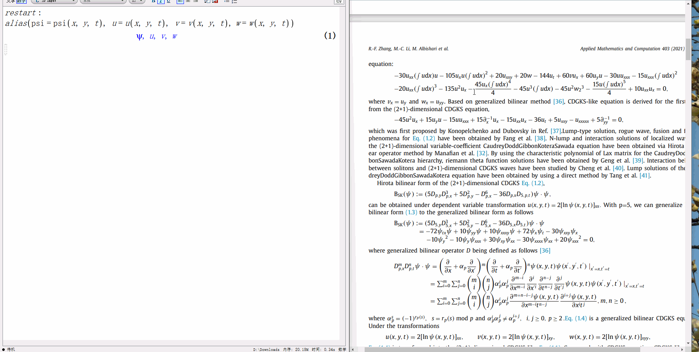

### maple2mma
将Maple中的数学公式转为Mathematics公式，主要是诸如sin(x) --> Sin[x]之间的转化。 只需直接复制Maple输出的数学公式到输入框(注意, 这里的数学公式指的是 maple 输出的数学公式, 而不是经 `latex` 函数转化以后的结果)，点击按钮, 会出现一个小窗口
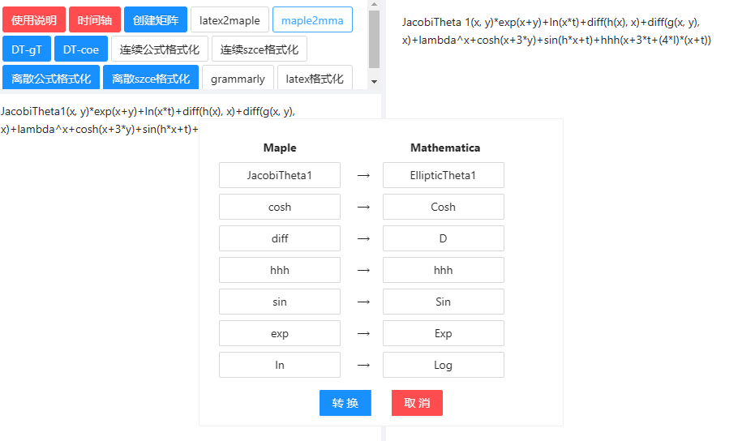
罗列出 maple 表达式中每个函数对应于 mma 中的函数(可以修改), 点击 `转换` 按钮即可.

### DT-gT & DT-coe
主要用于经典达布变换系数的整理。 

> 不再维护。

### 连续(离散)[szce]公式格式化 
将Maple中的数学公式经latex函数转为Tex代码以后， 复制到输入框， 将其处理为正常的Tex代码， 如求导运算等。

如下图所示:
- 离散情形
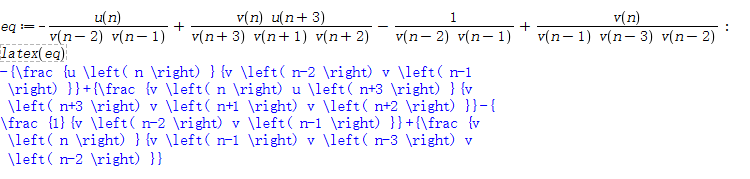
点击 `离散公式格式化`
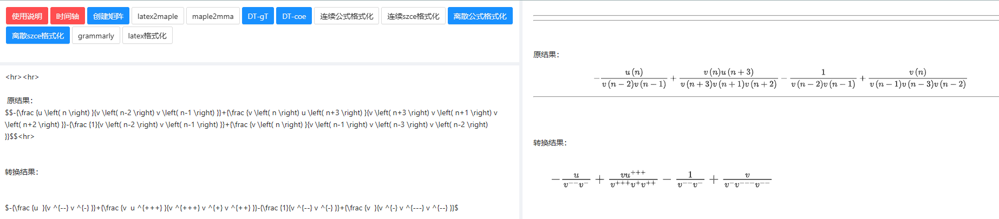
上图左侧为原结果和转化结果, 右侧为原结果和转化结果的显示, 可以发现对原结果进行了极大的简化. 另外, 也可根据显示结果检查是否有转化错误.
- 连续情形
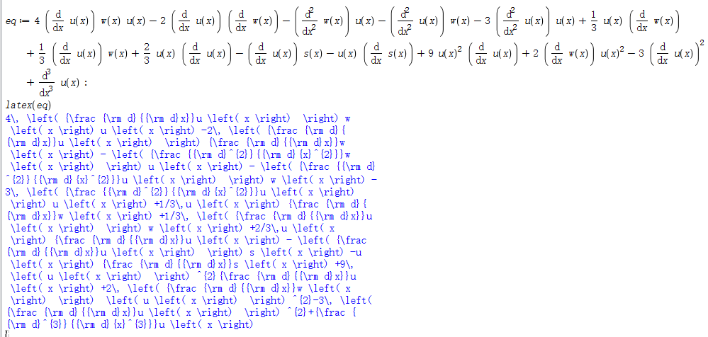
点击 `连续公式格式化`
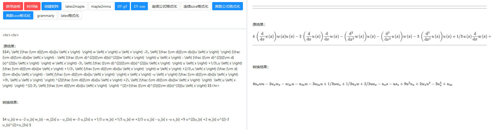
注意, 对于多阶导数, 用 $u_{kx}$ 表示 $\partial_x^k u$.

### 展式系数格式化
守恒律相关， 不再维护。

### grammarly
复制整个论文的Tex文件到输入框， 可以将其中的数学公式等相关信息删除， 然后使用Grammarly检查拼写及语法。

### Tex格式化
复制整个论文的Tex文件到输入框， 对其格式化： 添加缩进， 断句(英文句号换行)。

### typora
渲染typora生成的markdown文档(支持数学公式). 也可简单渲染tex文档.
> 该功能已经被单独开了一个网站[tex-md](https://jiandandaoxingfu.github.io/md-tex-renderer).

## 相关库
- create-react-app： 框架。
- ant-design： 提供页面布局和UI。
- remarkable： 渲染Markdown文档。
- MathJax： 渲染数学公式。

## Todo
- 目前程序对于混合导数的处理还有问题.