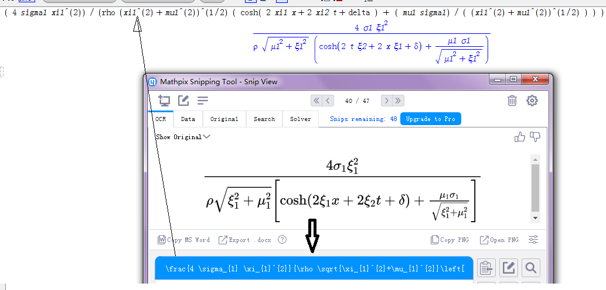
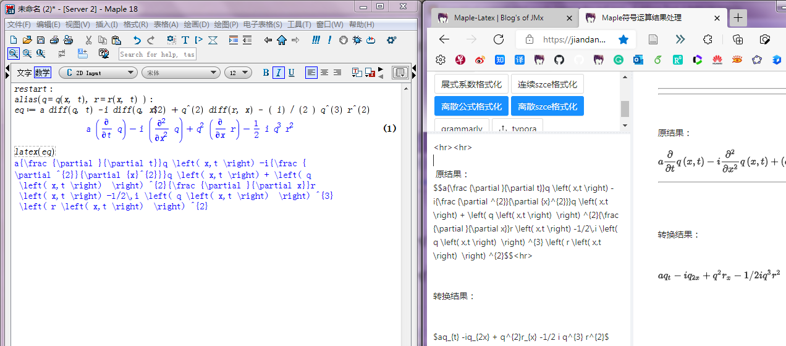
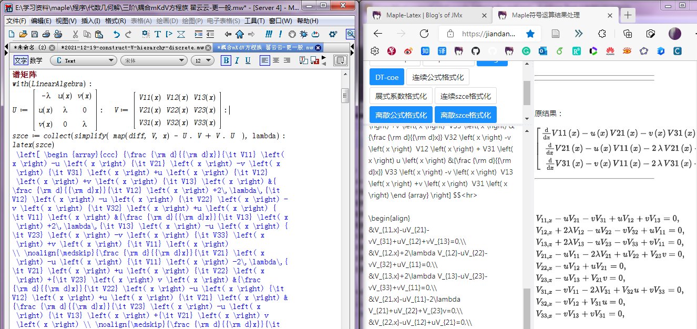

### 简介
> 这是工具[maple-latex](https://jiandandaoxingfu.gitee.io/maple-latex)的使用文档。 主要用来处理符号运算中， 
Maple, Mathematics, Tex三者之间数学公式的转化。
欢迎使用， 如出现错误， 可以把相应的tex代码和错误描述
发送至: jiaminxin@outlook.com。 或者到项目[maple-latex](https://gitub.com/jiandandaoxingfu/maple-latex)提issue。

### 功能

#### 使用说明
略

#### 创建矩阵
可视化创建Tex矩阵/列表， 生成相应代码

#### Excel转列表
复制Excel表格中的数据， 转为Tex列表

#### latex2maple
使用mathpix snipping tool识别PDF文件或图片中的数学公式， 将其生成的Tex代码复制在输入框， 点击按钮即可将Tex代码转成相应的Maple程序。 
如果需要将Maple程序转为Mathematics程序， 可以再使用maple2mma功能。

如下图所示: PDF(IMG) ==mathpix snipping tool==> Tex ==latex2maple==> Maple

#### maple2mma
将Maple中的数学公式转为Mathematics公式， 主要是诸如sin(x) --> Sin[x]之间的转化。 只需直接复制Maple输出的数学公式到输入框， 点击按钮即可。 

#### DT-gT & DT-coe
主要用于经典达布变换系数的整理。 不再维护。

#### 连续(离散)[szce]公式格式化 
将Maple中的数学公式经latex函数转为Tex代码以后， 复制到输入框， 将其处理为正常的Tex代码， 如求导运算等。

如下图所示:

#### 展式系数格式化
守恒律相关， 不再维护。

#### grammarly
复制整个论文的Tex文件到输入框， 可以将其中的数学公式等相关信息删除， 然后使用Grammarly检查拼写及语法。

#### Tex格式化
复制整个论文的Tex文件到输入框， 对其格式化： 添加缩进， 断句(英文句号换行)。

#### typora
渲染typora生成的markdown文档， 支持数学公式。

### 参考
- create-react-app： 框架。
- ant-design： 提供页面布局和UI。
- remarkable： 渲染Markdown文档。
- MathJax： 渲染数学公式。