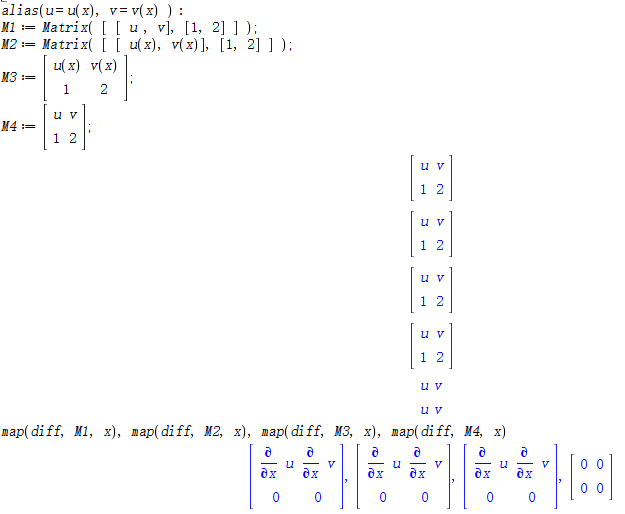



这里简单介绍一下Maple的使用. Maple和Mathematica (简称mma)以及Matlab并称为三大科学计算软件.
后两个软件的使用者很多, 网上教程也比较丰富. 
目前国内使用Maple的较少, 资料不多, 网上很多东西都搜不到.
Matlab更加精于数值矩阵运算, 如果需要符号计算, 可以使用其`Mupad`工具箱.
Mma 则各方面都可以, 但是我个人用起来不太习惯.
Maple 较强于符号计算, 其输入更加符合数学习惯.
Maple 安装完成占用空间大概为`1.3G`(这里以 Maple 18为例), 而后两个大于`10G`.


## 基本用法
学习一门编程语言一般只需要掌握以下几点就可以正常使用了, 至于其它的特性则需要在使用中不断学习. 
不建议上来就抱着一本几百页的数一点一点的看, 太慢了, 而且不用的话, 很难理解.
平时学习中, 要学会偷懒, 能用计算机算, 就不要手算, 这样才能提高编程能力.

> 下面的内容均基于 **Maple 18 (2014.1.24) 版本**. 部分地方可能会与新版本不同, 例如, 2022版矩阵求导不需要`map`, 但是如矩阵积分依然需要`map`, 其它常用的符号计算的命令并没有太大的改变.
而且Maple 18版安装包压缩包只有`0.6G`左右, 安装完成占用空间为`1.3G`, 而Maple 2022版有`3.3G`, 安装完成为`6G`左右. 老版本更加轻量, 而且部分运算比新版本更快.
另外, 新版本通常向下兼容, 而老版本打开新版本的程序可能无法运行.
另一个原因在于新版公式显示以及`latex`函数生成的代码与旧版不同, 因此[maple-latex](https://jiandandaoxingfu.github.io/maple-latex/)处理maple生成的tex代码功能也需要升级, 这太麻烦了.

### 创建文件
点击左上角`文件` -> `新建` -> `文件模式`. 或者使用快捷键 `Ctrl` + `N`.

之后如下


### 输入和输出
上图中可以看到有`文字`和`数学`两个选项.
点击`文字`, 鼠标所在行可以写文字, 不会运行, 可以正常换行等操作. 
文字环境一般用来写程序说明, 即注释, 来说明程序是用来干什么的, 为什么, 以便阅读. 
如果不加注释, 时间久了就容易忘. 而且程序可能会给别人用, 不加注释是很难读的.

点击`数学`, 鼠标所在行会变成数学环境, 并且有虚线框.

两种环境可以用快捷键`F5`来快速切换.
在数学环境下, 按回车键`Enter`会运行当前代码块, 想要换行的话, 需要使用`Shift` + `Enter`.
对于多行的代码块, 尽量一行只进行一个命令, 不要把很多命令全放在一行, 这样太长, 不容易读.
多行代码中每一行代码都需要以分号或者冒号结束, 最后一行可以不加. 如下所示

不加分号或者冒号, 会认为仍然接上一行, 有时会报错.
从上图还可以看出分号会输出, 冒号则不输出.
在数学环境中, 也可以加注释, 但是需要在注释前面加`#`, 该符号后面的内容不会运行, 可以起到注释的作用.
不过一般不这么做, 把代码和注释写在一块太乱.

在数学环境的开头或者结尾可以按`F5`切换至文字环境, 换行后再切换至数学环境来对代码进行分块.

一些输入特性:
|特性|解释|
|:-|:-|
| 自变量 | 定义函数不需要先定义自变量, 直接使用, 这一点与 matlab 不同.|
| 次方 | 输入 `^` 会直接变成上标.|
| 下标 | 需要用 `[]`, 下标放在中括号里面即可.|
| 分式 | 输入 `/` 会直接变成分式.|
| 希腊字母 | 希腊字母的英文名输入直接变成数学符号, 输入中如果用 `^` 作用一次, 也会直接变成数学符号, 更加清晰.|
| 百分号 | 在 Maple 中, 可以用 `%` 来表示上一步运行的结果, 直接引用, 免去定义或者复制.|

示例


### 定义变量
```javascript
a := 3;  # 定义变量不是用等号， 而是用冒号等号
b := 4:  # 冒号不打印
c := 3 * 4; # 分号打印
#  两个变量或者数字与变量的乘积可以省略乘号，但两个数字的乘积不能省略

# 定义表达式, 注意不能定义 f(x) := ...
f := a x^2 + b x + c;  

# 需要注意的是, 上面所定义的变量都是全局变量, 运行过以后, 在程序的任何地方都可以引用
# 在后面的自定义函数中, 我们会看到局部变量, 它们只在函数体内有效

# 如果想要删除某个变量, 可以使用如下命令
unassign(`a`, `b`) # 取消给 a 和 b 赋值

# 有时候为了方便输入, 会使用别名来定义变量, 这样在后面用u, v的时候就会隐去x
alias(u=u(x), v=v(x));
```

图中第一行由于 v 没有定义, 默认为常数, 因此求导为 0.

> 需要特别注意的是, 输入时, 字母和括号前/后, 括号与括号前/后尽量添加空格(函数除外, 如`f(x)`), 如`x * (a + b)` 省略乘号时要加空格, `x(a + b)` 通常会被是为 $x$ 关于 $a+b$ 的函数. 此外, `)(` 之间也要加空格, 否则可能会有问题. 一旦出现这种错误, 很难被发现.

### 变量类型
上面定义的变量都是单个的表达式或者数字, 对于多个表达式, 可以用集合, 矩阵, 列表等类型.

**矩阵**

基本与数学中的一致.
```javascript
with(LinearAlgebra):  # 使用矩阵及其操作， 需要引入线性代数包
M := Matrix( row, col ); # row * col阶矩阵
M := Matrix( row ); # row阶方阵
M := Matrix([ [1, 2, 3], [4, 5, 6], [7, 8, 9] ]); # 三阶矩阵 或者
M := <1, 2, 3 | 4, 5, 6 |, 7, 8, 9>; # 注意这里与上面定义的M互为转置 
M[1, ..] # M的第一行(向量型)
M[.., 1] # M的第一列
M^-1 # M的逆
M . M # M^2
M[1, 1] := 4 # 可以给矩阵的某个元素赋值
Transpose(M);
HermitianTranspose(M);
Determinant(M);
coeMat, b := GenerateMatrix( [ eq1, eq2, ...], [ x1, x2, ...]);  # 获取系数矩阵和右端项
```


> 需要注意的是, 在使用`alias`时, 有如下区别(其中`M1`和`M2`是命令定义的矩阵, `M3`和`M4`是在输出复制的矩阵上进行了修改):
> 
可以看到, 在复制的矩阵中进行修改, alias不起作用, 因此 `M4` 求导为0. 即`alias` 中定义的函数不能出现在复制的矩阵(向量等)中, 否则会被视为常量, 后续计算会有问题, 还很难发现. 
另外, `M2`中`u(x)`也不太合适, 有时候会变成`u(x)(x)`. 规范的写法为`M1`或者`M3`.
> 不过, 对于下面这种情形
> ```javascript
> alias(u=u(x));
> q := diff(u, x) + u;
> ```
> `q`是可以出现在复制的矩阵中的, 因为其是一个表达式.

> 另外需要注意的是, 每一个由单个表达式或者数字定义的变量在计算机内存中的地址都不一样, 如
> ```javascript
> a := 3;
> b := a;
> ```
> 改变 `a` 的值不会影响 `b` 的值.
> 但是对于矩阵, 两者指向同一地址.
> ```javascript
> A := [1, 2, 3];
> B := A;
> ```
> 因此如果改变 `A` 中某个元素的值, 则 `B` 也会发生变化.
> 


**列表(list)**
```javascript
arr :=[1, 2, 3, 4]:
arr[3] # return 3;
arr[1..2] # return [1, 2];
arr[-1] # return 4
arr + arr # 列表也可以加减
```

列表引用似乎不会同时改变.

**集合(set)**

Maple中的集合与数学中的集合一致: 无序, 不重复.
```javascript
arr := { 5, 1, 2, 3, 4 }; # 无序(虽说无序, 但内部会按照数字/字母顺序排列), 不重复
arr[1] # 可能是1
intersect({1, 2, 3}, {3, 4, 5}) # return {3};
union({1, 2, 3}, {3, 4, 5}) # return {1, 2, 3, 4, 5};
{1, 2, 3} \ { 2 } # return {1, 3}
```
集合中的元素可以是任意类型, 但是需要注意, 集合中的元素没有顺序, 上面定义的 `arr[1]` 不是 5.


**向量**
```javascript
arr1 := <1, 2, 3, 4>; # 列向量
arr2 := < 1 | 2 | 3>; # 行向量
arr . arr2 # 矩阵
```


**序列**
```javascript
sequence := seq(1..3) # return 1, 2, 3
arr := [ seq(1..3) ] # 序列加`[]`变列表
set_ := { seq(1..3) } # 变集合, 这里加下划线是因为 set 是程序里面的关键字, 不能作为变量名
# 还有其它一些关键字, 如 if, then, do, list 等
sequence := seq( i^2, i=1..3 ) # return 1, 4, 9
sequence := seq( F[i](x), i=1..3) #
a, b, c := seq(1..3) # 使用序列可以给多个变量赋值
seq( seq(a[j, i](x), i=1..3), j=1..3 ); # return a_{11}, a_{12}, ..., a_{33}. # 多重, 常用来创建矩阵
```


**字典(table)**
```javascript
T := table([ a = 1, b = x^2, c = "abcde"  ]); 
T[a] #  1.
```

**字符串**
```javascript
s := "i am a string";
s[1..4] # = "i am";
```

字符串一般用于输出提示信息. 比如在一个程序中, 可以把各种提示信息打印出来.
```javascript
print("please input U");
```

### 流程控制
**判断**
```javascript
if x > 0 and (or) x < 4 then
   # do something;
end if;

if x > 0 and (or) x < 4 then
   # do something
elif x < 0 then
	# do something
else
	# do something
end if;
```
注意换行并添加缩进.

**循环**
```javascript
for i from 1 to 10 do
   # do something;
end do;

for i from 1 to 10 do
   if i mod 2 = 0 then
   	# do something
   end if;
end do;

arr := [1, 2, 3, 4];
for i in arr do
   # do something;
end do;

# 阶乘 n!
prod_ := 1;
n :=10;
for i from 1 to n do
	prod_ := prod_ * i:
end do: # 注意, 这里如果不用冒号, 每次循环都会输出 prod_;
print(prod_);
```


### 自定义函数
```javascript
func := (x) -> x^2: # 箭头函数, 注意与 func := x^2 的区别

func(4) # 16

# proc里面的量就是变量, 即输入, 而 return 后面是返回的结果, 可以返回多个
func := proc(x)
	global w, z; # 全局变量, 在整个程序中都存在
	local y; # 局部变量, 只存在于本函数体内
	y = x^2;
   return y;
end proc:

# 即 y = func(x);


func(4) # return 16

# 我们把阶乘函数抽象出来
factorial_ := proc(n)
	# local prod_, i; # 程序内除输入以外的变量都要声明是全局变量还是局部变量, 否则可能会有警告信息
	prod_ := 1;
	n :=10;
	for i from 1 to n do
		prod_ := prod_ * i:
	end do; 
	return prod_; 
end proc:

# 使用递归来定义, 递归可以看作一种循环, 适用于知道循环结束判断, 不知道循环次数的问题
factorial_ := proc(n)
	if n = 0 then
		return 1;
	else
		return n factorial_(n-1) ;
	end if
end proc:

# 递归实现汉诺塔问题, (由 ChatGPT 作答)
hanoi := proc(n, A, B, C)
  if n = 1 then
    printf("Move disk from %s to %s\n", A, C);
  else
    hanoi(n-1, A, C, B);
    printf("Move disk from %s to %s\n", A, C);
    hanoi(n-1, B, A, C);
  end if;
end proc:

hanoi(3, "A", "B", "C");
```


需要注意的是, 函数内部的命令行不论是以分号还是冒号结尾, 都不会打印, 因此需要`print`函数来进行打印.


## 常用命令
Maple中的内置命令一般都是选取英文名称或者前几个字母, 注意内置命令也不能作为变量名.

### 假设
```javascript
assume(x, 'real');
assume(x > 0, x < 5);
assume(x, 'real', y > 0);
about(x);
```
添加假设后, 输出时右肩膀会有一个"~"符号.

### 化简/因式分解/展开/分子/分母
```javascript
simplify / factor / expand / numer / denom
```


### 合并同类项/提取系数/次数
```javascript
expr := x^3 + 2 x^4 + (x+1)^3 + (2 x +3 y)^2 + y^2;
collect(expr, x);
collect(expr, [x, y]); # 先对 x 再对 y
collect(expr, diff); 
collect(expr, exp);
collect(expr, sin);
degree(expr, x) # x的次数
ldegree(expr, x) # x最低次幂
coeff(expr, x, 3) # x^3 的系数
lcoeff(expr, x)  # x最高次幂的系数
tcoeff(expr, x)  # x最低次幂的系数
coeffs(expr, x); # x 的各次幂系数

with(PolynomialTools):
CoefficientVector(x^3 + 2 x^2 + 3 x + 4, x); # <4, 3, 2, 1>

with(PDETools):
dcoeffs(expr, u); # u 的各阶导数的系数
```


### 排序
```javascript
sort([1,3,4,2]) # [1,2,3,4]
sort([1,3,4,2], `>`) # [4,3,2,1]
sort(x^3 + 2 x^4 + x + 3 x^2) # 2 x^4 + x^3 + 3 x^2 + x
```

### 分母有理化
```javascript
rationalize( 1 / (sqrt(1 - u^2) - 1) ).
```


### 替换
```javascript
# 表达式替换
subs(x=1, expr);
subs(x=1, y=2, expr);
subs({ x=1, y=2 }, expr);
subs({ x=1 }, { y=2 }, expr);
 
# 代数替换, subs替换模式是精确替换, 而代数替换会考虑代数关系
subs( x + y + z = t, expr ) # 只有当 x + y + z 项才会被替换
algsubs( x + y + z = t, expr ) # 一次只能有一个代数表达式, 与 subs 不同

# 微分替换, 常用于具有导数的式子
with(PDETools):
dsubs( f(x) = g(x), expr );
```


### 复数/小数
```javascript
sin(1) # sin(1)
evalf( sin(1) ) # 0.8414709848
evalf( sin(1), 4) # 0.8415
evalc( exp(3 I x + y) ) # exp(y)*cos(3*x)+I*exp(y)*sin(3*x)
```


### 公式生成 tex 代码
```javascript
latex(expr);
```

此处可以使用在线工具[Maple-Latex](https://jiandandaoxingfu.github.io/maple-latex/)来格式化其生成的tex代码, 去除冗余.


### 公式拆解/获取自变量/函数名
```javascript
op( f(x) ) # return x
op( 0, f(x) ) # return f
op( a + b c ) # return a, b c
op( a b ) # return a, b
op( -f / g) # return [-1, f, 1/g]
op( [1,2,3] ) # list to seq
[ op( [1,2,3] ), 4] # [1,2,3,4], 扩容
nops([1, 2, 3, 4]) # 获取数组长度
indets( A F(x) + B ) # { A, B, F(x), x }
indets( A F(x) + B, name ) # { A, B, x}
indets( A F(x) + B exp(x), Function ) # { F(x) }, 获取表达式中的未知函数
indets( A F(x) + B int(F(x), x), function ) # {F(x), int(F(x), x)}, #获取表达式中的函数项
```


### 变量转换
```javascript
convert( 1/3, float ) #  return 0.3333333...
convert( f(x), string ) # return "f(x)"
convert( "f", symbol ) # return f
convert( [1, 2, 3, 4], set ) # return {1, 2, 3, 4}
convert(expr, sin); # 把所有函数都用正弦函数来表示
convert(expr, exp); 
convert(expr, sech);

# 也可用 op
{ op( [1, 2, 3, 4] ) }; # { 1, 2, 3, 4 }
convert( [1, 2, 3, 4], Matrix, 2 );
convert( seq( seq(V[j, i](x), i=1..3), j=1..3 ), Matrix, 3, 3 ) # (V_{ij})_{3*3} # 列表转矩阵
```

另外, 有时候在处理一些矩阵或者数组时, 需要转成字符串来处理. 之后再转回来. 这需要使用 `parse` 来解析.


### 微分/积分
```javascript
diff(f, x);
diff(f, x$k) # k阶导数
diff(f, x$2, t$3);
int(f, x); # 不定积分
int(f, x=0..1); # 定积分
seq( diff( f(x), x$i ), i=1..3)
```
需要注意的是, 在一些低版本中, 求导积分等一些运算只能作用域单个表达式, 不能作用域集合, 矩阵等.


### 映射
将某个函数作用于数组, 列表, 矩阵等多维表达式的每一个元素.
```javascript
map(f, [x, y, z], a); # return [f(x, a), f(y, a), f(z, a)];
map2(f, a, [x, y, z]) # return [f(x, 1), f(y, 2), f(a, z)];
arr := [ seq(1..3) ];
map( x-> x^2, arr ); # return [1, 4, 9] map可以替代for循环， 更加方便。
map(sin, arr); # sin 函数作用于每一个元素
V := convert( seq( seq(V[j, i](x), i=1..3), j=1..3 ), Matrix, 3, 3 );
map(diff, V, x) # 矩阵求导
map(op, 0, arr) 
map(expand, M);
# 另外, 也可以使用 ~ 来代替map, 如
sin~(arr)
diff~(arr, x)
```

另外还有`zip`函数, 可以将某个函数同时作用于两个结构体对应的元素
```javascript
zip(f, [1,2,3], [4,5,6]) # [f(1,4), f(2,5), f(3,6)]
zip(`*`, M1, M2) # 两个矩阵对应元素相乘
```

### 求解方程(组)
```javascript
solve( eq = 0, x ); # 右端等于0可以省略
solve( eq, { x });
solve({ eq1=b1, eq2=b2, ... }, { x1, x2, ... });
solve( eq > 0, x);
```


### 求解常微分方程(组)
```javascript
# 常微分方程
dsolve( deq = 0, y );
dsolve({ deq1=b1, deq2=b2, ... }, { y1, y2, ... }) 
# 偏微用 
dsolve( deq = 0, y );
dsolve({ deq1=b1, deq2=b2, ... }, { y1, y2, ... }) 
# 同样右端等于0可以省略
```


### 泰勒展式与幂级数展开
```javascript
taylor( f(x), x=0, 3 ) #  在 x=0 处展开, 精确到 x^3
series( f(x) / x, x=0, 3 ) # 类似
convert( series( f(x) / x, x=0, 3 ), polynom ) # 去掉大 O 项
```

级数的一个妙用(注意多项式是三次的, 所以要精确到三次项, 因此展开到四次)


### 符号连接
```javascript
cat('v', 1, 2) # return v12;
seq(cat('v', i), i=1..3) # return v1, v2, v3
seq(seq(cat('v', i, j), i=1..3), j=1..3 ) # return v11, v12, ..., v33
convert([seq(seq(cat('v', j, i), i = 1..3), j = 1..3)], Matrix, 3) # return (vij)_{3*3}
# 或者
cat('v', 1, 2); 
cat('v', 1 .. 3); 
cat('v', 1 .. 3, 1 .. 3); 
convert([cat('v', 1 .. 3, 1 .. 3)], Matrix, 3)
```


### 类型判断
```javascript
is(5 > 10) # false
type(f(x), function) # true
has(f(x), x) # true
has(sin(x) + cos(x), sin) # true
hasfun(diff(g(x), x), diff); # true
whattype(x) # symbol
whattype(exp(x)) # function,
whattype(x - y) # `+`
whattype( x y) # `*`
```

### 选择/移除
```javascript
select(i -> i mod 2 = 0, [1,2,3,4]) # [2,4]
remove(i -> i mod 2 = 0, [1,2,3,4]) # [1,3]
select(has, [f(x), a, b], x) # [f(x)]
select(type, [f(x), a, b], function) # [f(x)]
```

### 绘图
```javascript
plot( sin(x), x=-3..3 );
plot3d( sech^2(x/6 + t) , x=-3..3, t=-3..3);
plot3d( k^n exp(3 t), n=-10..10, t=-5..5, grid=[21, 100] );
```

Maple 还可以绘制动画, 例如我们有一个(2+1)-维偏微分方程的解, 那么可以将时间`t`作为参数进行绘制, 看图形随时间的演化
```javascript
with(plots):
u := sin(x + y + t):
animate(plot3d, [u, x = -10 .. 40, y = -10 .. 40, grid = [100, 100]], frames = 50, t = 0 .. 50);
```


### 文件读取
我们可以把计算中产生的变量保存到文件, 下次直接读取文件即可得到数据. 
对于一些需要很长时间才能算出来的结果, 这样做很方便.
```javascript
save var1, var2, ..., "path/var.m"; # 保存多个变量到文件
read "path/var.m";
ExportMatrix("F:data.txt", mat) # 保存矩阵到记事本文件, mat为矩阵
```
Maple绘图一般很丑, 这一点比mma和matlab差很多. 如果想在maple上计算, 在matlab中绘图, 通常有两种方法.
其一是将maple计算的表达式直接复制到matlab中即可, 两者表达式除去一些特殊的以外基本类似, 然后用matlab绘图即可.
另一种是先在maple中取点, 然后将点坐标矩阵导出, 之后用matlab读取直接绘制.
我们以`sin(x+t)`为例, 绘制其在单位矩形上的三维图形, 为了方便, 我们将此操作定义为函数.
下面是示例代码.
首先定义Maple中的函数
```javascript
maple2matlab := proc(func, range, step, path, filename)
	# func: 关于x和t的二元函数, 如 sin(x, t)
	# range: x和t的范围, 四元列表, [xmin, xmax, tmin, tmax], 如 [-5, 5, -5, 5]
	# step: 二元列表, 分别是x和t的步长, 如 [0.1, 0.1]
	# path: 保存路径, 如 "F:/"
	# 文件名: 如 "data.txt"

	local x_min, x_max, t_min, t_max, x_step, t_step, X, Y, Z, row, col, data;

	with(ListTools): 
	with(LinearAlgebra):
	
	x_min, x_max, t_min, t_max := op(range): 
	x_step, t_step := op(step):
	
	# 取点
	# data 为 3 * (n + 1) 的矩阵
	# data 的第一列是: row, col, 0
	# 后面的列是三维坐标
	# X, Y, Z 都是 row * col 的矩阵, matlab中绘图为 surf(X, Y, Z)
	
	X := Matrix([seq([seq(x, x = x_min .. x_max, x_step)], t = t_min .. t_max, t_step)]): 
	Y := Matrix([seq([seq(t, x = x_min .. x_max, x_step)], t = t_min .. t_max, t_step)]): 

	# 注意这里需要将数据转化为浮点数, 否则依然带着函数, 如sin等
	Z := convert(zip((a, b) -> subs({x=a, t=b}, func), X, Y), float): 
	row, col := Dimension(X): 
	data := Matrix([[row, op(convert(X, list))], [col, op(convert(Y, list))], [0, op(convert(Z, list))]]):
	
	# 导出
	ExportMatrix(cat(path, filename), data);
	print(cat("已将数据导出到: ", path, filename ));
end proc:
```
接着调用, 即可导出数据到文件
```javascript
maple2matlab(sin(x+t), [-1, 1, -1, 1], [.1, .1], "F:/", "data.txt");
```
然后用matlab读取数据. 首先定义Matlab中的函数(将其保存为`maple2matlab.m`文件)
```javascript
function [X, Y, Z] = maple2matlab(path, filename)
	% 读取 maple 导出的三维图形坐标, 并将其转化为矩阵
	% matlab 读取的数据变成了 3 * (n + 1) = 3 * N 列向量
	% row:  1
	% col:  N + 1
	% 0:    2N + 1
	% X:    2:N
	% Y:    N+2:2N
	% Z:    2N+2:3N
	
	fileID = fopen( strcat(path, filename) ,'r');
	data = fscanf(fileID, '%f');
	fclose(fileID);
	
	N = length(data)/3; % N = n+1
	row = data(1);
	col = data(N + 1);
	X = reshape( data(2:N), row, col );
	Y = reshape( data(N + 2:2 * N), row, col );
	Z = reshape( data(2 * N + 2:end), row, col );
end
```
接着调用, 绘制图形
```javascript
[X, Y, Z] = maple2matlab('F:/', 'data.txt');
surf(X, Y, Z);
```

### 程序运行时间和占用内存
使用`timelimit`函数可以设定程序运行时间, 超过时间程序会停止运行. 如
```javascript
sum_ := proc()
	global i, s;
	s := 0;
	for i from 1 to 10^8 do
		s := s + i;
	end do;
end proc:

try 
	timelimit(0.1, sum_() );
catch:
	print("time limit");
end try:

print(i, s)
```
即0.1s后停止计算, 程序内的变量依然存在. 

另外, 使用命令`kernelopts(bytesalloc)` 可以获取程序占用的内存(单位为字节, 除以1024^2为我们熟知的兆字节). 
对于一些复杂的计算, 程序运行时会占用大量内存, 导致电脑卡顿甚至死机. 
因此可以在循环计算中使用此命令, 通过判断占用内存来提前停止计算, 防止电脑死机, 导致前面的计算丢失.


## 一些例子

### 多项式处理

考虑下面的多项式
```javascript
eq := -u(n+2) v(n-2)^2
	-v(n-4) u(n)
	+3 v(n-3) w(n-3) u(n)^2
	+v(n-3) u(n) w(n-1)
	+v(n-2) u(n+1) w(n)
	+u(n+2) v(n-1) w(n-1)
	+v(n-3) u(n) v(n-2) u(n-1)
	-4 v(n-3) v(n-4) u(n-3) u(n)
	+v(n-4) u(n-2) u(n) v(n-2)
	+v(n+1) u(n+2) v(n-2) u(n+1)
	+u(n+2) v(n-1) v(n-2) u(n-1)
	+u(n+2) u(n) v(n-2) v(n)
	-w(n-2) u(n) v(n-2) w(n-1)
	+u(n)^2 v(n-2)^2+v(n-4) v(n-1) u(n) u(n-1)^2
	+v(n-1) u(n) v(n-2) u(n+1)
	-v(n-1) w(n-1) u(n+1) w(n)
	+-2 v(n-1) u(n)^2 v(n-2) w(n-1)
	-u(n+2) v(n-1) u(n) w(n-1) v(n)
	-v(n-3) w(n-3) u(n-2) u(n) v(n-2)
	-v(n-3) u(n-2) u(n) v(n-2) w(n-1)
	-v(n-3) v(n-1) u(n) u(n-1) w(n-1)
	-v(n+1) u(n+2) v(n-1) w(n-1) u(n+1)
	-w(n-2) u(n) v(n-2)^2 u(n-1)
	-v(n-1)^2 u(n) w(n-1) u(n+1)
	-u(n) v(n-2) v(n) u(n+1) w(n)
	-v(n-1) v(n-2) u(n-1) u(n+1) w(n)
	-v(n-3) w(n-3) v(n-1) u(n) u(n-1)
	+v(n-1)^2 u(n)^2 w(n-1)^2-v(n-3) u(n-2) u(n) v(n-2)^2 u(n-1)
	-2 v(n-1) u(n)^2 v(n-2)^2 u(n-1)
	-v(n+1) u(n+2) u(n) v(n-2) v(n) u(n+1)
	-u(n+2) v(n-1) u(n) v(n-2) u(n-1) v(n)
	-v(n+1) u(n+2) v(n-1) v(n-2) u(n-1) u(n+1)
```
每个单项式由 $u, v, w$ 及其它们的位移相乘, 想要根据因子数(按重数记, 如第一项有三个因子, 第二项有两个)进行分类. 
首先利用 `op` 函数对其分解
```javascript
eqs := [ op(eq) ];
```
然后使用 `map` 函数对每一项进行处理. 问题在于怎么判断因子数.
一个比较简单的想法是令 $u=v=w=10$, 这样每一项都会变成 $10$ 的倍数, 只需要数 $0$ 的个数就可以了 (这里 $10$ 要大于每一项前面的系数, 不然就取更大的数).
```javascript
num := subss( { u(n)=10, v(n)=10, w(n)=10 }, eqs ); # subss 是对 subs 的改写, 可以替换 u(n-1), u(n+1), ...
# 这样, 结果就变成了
# num = [-10^3, -10^2, 3*10^4, ...]
```
那么怎么数 $0$ 的个数呢? 可以考虑对绝对值取以 $10$ 为底的对数(注意到 $\log_{a}b = \frac{\log b}{\log a}$), 即
```javascript
num2 := map( a -> evalf( log( abs(a) ) / log(10) ),  num );  #  [ 3, 2, 4 + log 4/ log 10, ... ]
```
注意, 这里因为每一项前面可能有一个系数 (小于 $10$), 所以会出现小数 (小于 $1$). 因此只需要再取下整即可.
```javascript
num3 := map( floor, num2 ) # [3, 2, 4, ...]
```
这样, 就可以根据每一项对应的 `num3` 中的值来进行分类.
```javascript
map( a -> if floor( evalf( log( abs(subss( { u(n)=10, v(n)=10, w(n)=10 }, a )) ) / log(10) ) ) = 3 then a end if, eqs );
```
这样就把因子数为 $3$ 的单项式挑出来了.
然后再用 `convert` 把它们加起来:
```javascript
convert( map( a -> if floor( evalf( log( abs( subss( { u(n)=10, v(n)=10, w(n)=10 }, a ) ) ) / log(10) ) ) = 3 then a end if, eqs ), `+`); 
```
当然也可以用序列把每一类都加起来:
```javascript
eqs := [ op(eq) ]; 
seq( convert( map( a -> if floor( evalf( log( abs( subss( { u(n)=10, v(n)=10, w(n)=10 },  a) ) ) / log(10) ) ) = i then a end if, eqs ), `+`), i=1..10)
```

### 微分表达式处理
**获取导数项**

考虑下面的微分多项式
$$
expr := -\frac{i}{2} u^{3}v \alpha_{5}+i u^{2}\alpha_{3}-\frac{i}{2} u^{3}v \alpha_{4}+i u^{2}\alpha_{2}+\frac{i}{2} v^{3}u \alpha_{5}-i v^{2}\alpha_{3}+\frac{i}{2} v^{3}u \alpha_{4}-i v^{2}\alpha_{2}-\frac{1}{2} u_{x} u \alpha_{5}-\frac{1}{2} u_{x} u \alpha_{4}-\frac{1}{2} v_{x} v \alpha_{5}-\frac{1}{2} v_{x} v \alpha_{4} .
$$
我们想要获取上式中不含导数的部分, 只需使用如下命令
```javascript
convert( remove(hasfun, [ op(expr) ], diff), `+`) 
# or
convert( select( f -> not( hasfun(f, diff) ), [ op(expr) ]), `+`) 
```

**获取导数的阶数**

给定一个函数的导函数, 可以使用循环和判断来获取其阶数. 也可以使用`dsolve`求解, 然后获取自变量的最高次幂.
```javascript
eq := diff(u(x), x$6);
sol := dsolve(eq, {u(x)}); # u = C_1 x^5 + C_2 x^4 + ...
ord := degree(op(sol)[2], x) + 1; # 6
```
当然, 也可以使用`dsubs`:
```javascript
with(PDETools):
eq := diff(u(x), x$6);
ord := 100 - degree(dsubs(u(x) = x^100, eq), x);
```

### 绘制三维图形及其俯视图
想要绘制三维图形并在其下方绘制俯视图(或者密度图), Maple中没有提供这样的函数. 
虽然它可以绘制密度图(`plots -> densityplot`), 但是其为2D, 不能与3D图形放在一块, 不过 Maple 支持将多个3D图形放在一块.
一个巧妙地思路是将俯视图(或者密度图)也看作是三维图形, 将其高度设为原来的 $1/100$ 即可, 而且还可以通过减去一个数来进行平移.
如下
```javascript
with(plots):
f := sech(x + t)^2:
p1 := plot3d(5 f, x=-5..5, t=-5..5, style=patchnogrid, color=f):
p2 := plot3d(f/100 - 5, x=-5..5, t=-5..5, style=patchnogrid, color=f):
display(p1, p2)
```
上面 `style=patchnogrid` 表示去掉网格线, `color=f`表示根据`z`坐标来进行染色.
效果如下:

类似地, Matlab中虽然提供了俯视图(密度图)函数(`imagesc` 或者 `contourf`)且可以绘制在同一个坐标轴下(绘制在`z=0`平面), 但无法单独对俯视图平移. 如果三维图形经过`z=0`平面, 则两者相交.
因此也可采用上述方法来实现这一操作.


### 求解复线性方程组
Maple 可以直接求解复的线性方程组(即变量及其共轭同时出现), 但有时候会带有 `RootOf` 函数, 需要手动化简, 比较麻烦.
另一种做法是将变量和方程组的实部和虚部分开, 这样变量和方程都变为原来的二倍.
一般来说, 如果方程组里面有指数函数, 则实部虚部分开会出现三角函数, 计算完成再组合到一块然后转化成指数函数.
见下面的例子
```javascript
with(LinearAlgebra):

A := Matrix([ [A11 + I B11, A12 + I B12], [A21 + I B21, A22 + I B22] ]):
Ac := subs(I = -I, A):
c1 := Matrix([ [alpha, beta], [0, 0] ]):
c2 := Matrix([ [0, gamma], [0, delta] ]):
eq1 := c1 . A exp(I x / (a + I b)) + c2 . Ac exp(I x / (a - I b)) + IdentityMatrix(2):

eq2 := convert(eq1, set):
getReIm := expr -> [ remove(has, evalc(expr), I), -I select(has, evalc(expr), I) ]:
eq3 := map( eq -> op( getReIm(eq) ), eq2):
sol := solve(eq3, indets(A, name)):

n:=4:
< seq( simplify( convert(sol[i] + I sol[i + n], exp) ), i=1..n ) >
```


### 矩阵符号运算

符号计算中, 当不确定矩阵维数时, 需要保证不满足交换律, 同时保持求导等运算. Maple的`Physics`包中提供了可以定义符号变量为非交换元素, 从而可用于矩阵的符号运算中去. 具体使用如下:
```javascript
with(Physics):
Setup(mathematicalnotation=true):
Setup(noncommutativeprefix={U, V, X, ... }):
eq := U V - V U; # eq != 0.
```

### 自定义模块

在日常使用中, 对于经常要使用的代码, 可以封装成模块, 放在Maple库中, 方便使用. 像线性代数包`LinearAlgebra`, 微分方程包`PDETools` 等. 其定义方式类似于`procedure`函数,
```javascript
MyModule := module()
	option package;

	export add; # 要导出的函数, 变量等
	local minus; # 不需要导出的函数, 变量

	add := proc(x, y)
		return x + y;
	end proc:

	minus := proc(x, y)
		return x - y;
 	end proc:

end module:
```
运行上述程序, 然后再运行如下命令将其保存在Maple库中(这里假设Maple安装路径为`D:/maple 18`)
```javascript
savelib(MyModule, "D:/maple 18/lib/MyModule.mla");
```
运行完以后可以在该目录下看到`MyModule.mla`文件. 之后就可以像使用内置包, 如LinearAlgebra包一样使用. 任意一个程序中运行
```javascript
with(MyModule)  # return [add]
```
然后就可以愉快的使用`add`函数了
```javascript
add(3, 5) # return 8
```
非常的方便.

### 程序优化
- 将 $\sqrt{2I - 4}$ 经`evalc`作用改写为 $\sqrt{\sqrt5 - 2} + I\sqrt{\sqrt5 + 2}$, 当上述值在函数中出现多次, 此方法可以加速计算, 快速绘制出图形. 


## 注意事项

**帮助文档**

学习一门语言最好的资料是软件自带的帮助文档, 其中详细的介绍了内置函数的各种用法和例子.

在上面的输入框中输入函数名, 点击进入相应的文档即可.


**注释**

写的程序一定要添加注释, 特别是程序很长的, 要分成若干块. 

**清晰**

写的程序要清晰明了, 特别是流程控制合函数体内, 要使用空格或者缩进来加以区别, 不能都是从头开始.


**简洁**

每一行代码不宜过长, 多用换行. 每个函数也不宜过长, 一个大的函数应该分成若干个子函数.

**一般性**

写的代码要有普适性, 能够很方便的移植到其它地方. 
比如处理二阶谱问题的程序, 应该可以迁移到高阶谱问题.
此类可以将阶数定义出来, 后面用到阶数2的时候用变量代替, 后续改成3就很容易.

**变量命名**

给变量命名要么起一个英文名, 一看就知道是什么意思. 或者和文章中的符号保持一致.


## 下载









> 上面的`离散可积方程的Darboux变换`程序中用到了 `SolveDifferenceEq` 和 `DiscreteHierarchy` 两个包中的一些函数, 需要把以上两个包放在Maple安装路径的`lib`文件夹下, 即`maple 18/lib/`里面.
这两个包的下载和使用方法可以参见文档 [SolveDifferenceEq](https://jiandandaoxingfu.github.io/myblog/post/solve-difference-equation/) 和 [DiscreteHierarchy](https://jiandandaoxingfu.github.io/myblog/post/derive-hierarchy/).


