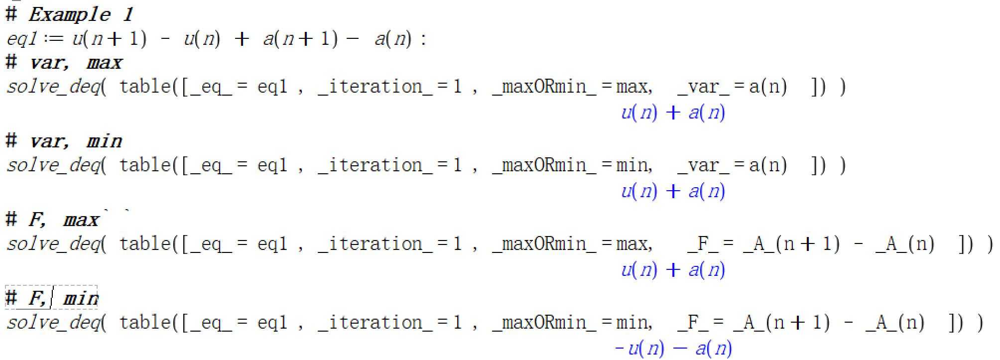
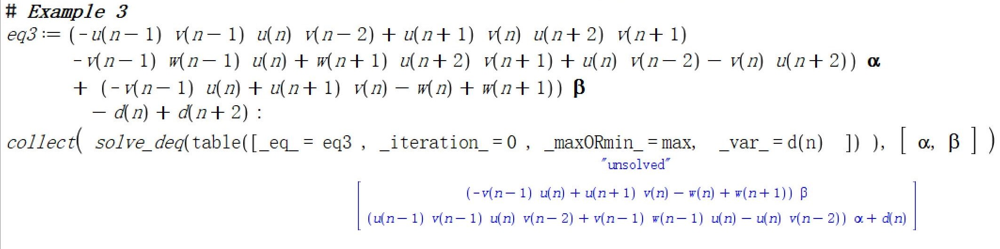



这里我们记录一下使用Maple计算可求解差分方程(存在显式解的差分方程)的程序实现。

## 算法
首先，我们要求解的是关于$A$的形如下面的差分方程
$$
\begin{array}{l}
A\_m + F(\dots, A\_{-1}, A,\dots, A\_{m-1}) = G\_{p},
\end{array}
$$
其中$A\_m = A(n+m)$，$F$是关于$A\_{m-k}, k\geq1$的有理函数(一般为变系数多项式)。 等式中与$A$无关的项全部归于$G\_{p}$。 在给出程序之前， 我们首先考虑如何求解此类问题。 考虑一个简单的方程
$$
\begin{array}{l}
A^+ + A = u^{\+\+} - u.
\end{array}
$$
其解自然是$A=u^+ - u$(这里我们不考虑“积分常数”)。 我们思考一下我们是如何“自然”给出解的。 观察等式两端，显然$u^{\+\+}$必然出自于$A^+$， 因此我们不妨做变换$A^{+}=A'^{+} + u^{\+\+}$，代入方程得
$$
\begin{array}{l}
A'^+ + A' = -u^+ - u.
\end{array}
$$
同理，我们做变换$A'^{+}=A''^{+} - u^{+}$，则
$$
\begin{array}{l}
A''^+ + A'' = 0. 
\end{array}
$$
由于我们不考虑“积分常数”，此时$A''$自然为$0$。 从而
$$
\begin{array}{l}
A = A' + u^{+} = A'' + u^+ - u = u^+ - u.
\end{array}
$$
我们发现以上的求解步骤中，遵循一个原则，即等式右端位移算子指数最大项$g\_p$，来自于$A\_m$。 然后我们做变换$A\_m = A\_m' + g\_p $，得到新的方程
$$
\begin{array}{l}
A\_m' + F(\dots, A'\_{-1}, A',\dots, A'\_{m-1}) = G\_{p-1}',
\end{array}
$$
重复上述步骤，即可得到
$$
\begin{array}{l}
A\_m^{'\dots'} + F(\dots, A\_{-1}^{'\dots'}, A^{'\dots'}, \dots, A\_{m-1}^{'\dots'} )= 0,
\end{array}
$$
从而取$A^{'\dots'}=0$， 得$A\_m = A\_m^' + g\_p = A\_m^{''} + g\_p + g\_{p-1}^' = \dots$。 如果不能经过有限次得到上式， 那么我们认为该方程没有显式解。

## 程序

我们利用Maple来实现上述算法, 函数名为`solve_deq`.

### 大致思路

算法的关键在于获取$G\_p$中位移算子指数最大项$g\_p$。 幸运的是， 我们可以通过Maple内置的`op`函数计算$g\_p$。 这里我们简单说明如果利用`op`函数计算$g\_p$。 对于一个由有理分式组成的“多项式”形如
$$
\begin{array}{l}
expr = {\dfrac {u ^{\+\+} u ^{\+\+\+} u ^{\+\+\+\+} }{v ^{\+\+} v ^{\+\+\+\+\+} v ^{\+\+\+\+} }}-{\dfrac {u ^{\+\+} }{v ^{\+\+} v ^{\+\+\+\+\+} }}+{\dfrac { \left( u ^{\+\+} \right) ^{2}u ^{\+\+\+} }{ \left( v ^{\+\+} \right) ^{2} v ^{\+\+\+\+} }} 
\end{array}
$$
经`op`作用` op(expr)` 可将上述“多项式”分解为多个单项式， 即按加法(减法可变为加法)拆分
$$
\begin{array}{l}
{\dfrac {u ^{\+\+} u ^{\+\+\+} u ^{\+\+\+\+} }{v ^{\+\+} v ^{\+\+\+\+\+} v ^{\+\+\+\+} }}, \ \ \ -{\dfrac {u ^{\+\+} }{v ^{\+\+} v ^{\+\+\+\+\+} }}, \ \   \ +{\dfrac { \left( u ^{\+\+} \right) ^{2}u ^{\+\+\+} }{ \left( v ^{\+\+} \right) ^{2} v ^{\+\+\+\+} }} 
\end{array}
$$
而对于一个有理分式单项式， 即形如
$$
\begin{array}{l}
expr = {\dfrac {u ^{\+\+} u ^{\+\+\+} u ^{\+\+\+\+} }{v ^{\+\+} v ^{\+\+\+\+\+} v ^{\+\+\+\+} }}
\end{array}
$$
经`op`作用可将其按乘法(除法可变为乘法)拆分，变为单个函数(对于倒数，需要再经op作用一次)
$$
\begin{array}{l}
u ^{\+\+},\ \   u ^{\+\+\+},\ \  u ^{\+\+\+\+} ,\ \ \left( v ^{\+\+} \right) ^{-1},\ \   \left( v ^{\+\+\+} \right) ^{-2},\ \   \left( v ^{\+\+\+\+\+} \right) ^{-1},\ \   \left( v ^{\+\+\+\+} \right) ^{-1}
\end{array}
$$
最后， 对于单个函数， 经op作用可提取函数的自变量。 如对$u(n+2)$， 经op作用， 得$n+2$。 特别地， op作用于数字不变。  利用此特点， 我们取定$n$为一个足够大的数(这里是因为出现倒数时， 我们要多一次op作用， 因此我们对所有的项都做最大次(5次)的op叠加， 这样对于没有出现倒数的项， 如果不取定$n$， 则自变量会被进一步分解， 如$n+2$分解为$n, 2$，这样就无法判断大小)， 然后经5次op作用， 我们就可以获取多项式中位移算子的最大指数项。 

上述算法对于变系数差分方程，存在一定的问题，如对于
$$
\begin{array}{l}
A^+ - \dfrac{v^+}{v^{\+\+}}A^{\-\-}  = u^+ - \dfrac{v^+}{v^{\+\+}}u^{\-\-}. 
\end{array}
$$
显然，它的解为$A^{+}=u^{+}$， 然而，位移算子的最大指数项是$\dfrac{v^+u^{\-\-}}{v^{\+\+}}$， 这导致算法无法求解。 原因在于变系数对算法造成了干扰， 目前我们还没有找到行之有效的方法避免这种情况。 实际求解中，我们可以将上述算法改为取位移算子的最小指数项， 那么该问题就解决了。 但是对于其它问题未必。 当然，对于一些问题，可以交叉使用两者。 另外一种办法是做变换$w=v^{\-\-\-\-\-\-}$，则其不再影响，求解以后再做逆变换即可。


### 用法
```javascript
solve_deq(table([ _eq_ = eq, _iteration_ = iteration, _maxORmin_ = maxORmin, _var_ = var,
            _F_ = F, _m_ = 0, _sol_ = 0, _rep_ = rep]));
```

### 参数
其参数是一个table, 其各项分别表示
|||
|---:|:---|
| **\_eq\_**:| 差分(代数)表达式|
| **\_iteration\_**:| 非负整数(最大迭代次数)|
| **\_maxORmin\_**:| max/min (最大值函数或者最小值函数)|
| **\_var\_**:| (可选, 如果不给出, 则`_F_`必须给出) 要求解的未知函数|
| **\_F\_**:| (可选, 如果不给出, 则`_var_`必须给出) 关于\_A\_(n)的差分表达式|
| **\_m\_**:| (可选) 0|
| **\_sol\_**:| (可选) 0|
| **\_rep\_**:| (可选) \_eq\_中参数的取值|


### 例子
- 四种用法 

- 部分求解 
对于求解失败的问题, 我们会给出提示并返回两个参数, 第一个参数为剩余部分, 第二个参数为已经求解的部分.

- 不可求解 
注意, 此例子中因为包含 $\alpha$ 和 $\beta$, 所以需要在 `_rep_` 中给它们两个赋值(非零即可). 
另外, 观察剩余部分可知, 该部分不可求解, 但是可以导出$d^+ + d + \beta (w + uv^-)$. 而 $\alpha$ 部分是可以求解的. 因此有
$$
d = -\alpha(u^-v^-uv^{\-\-} + v^-w^-u - uv^{\-\-}) - \beta (E+1)^{-1}(w + uv^-).
$$

## 代码
我们将程序放在[Github代码库](https://github.com/jiandandaoxingfu/solve-difference-equations)， 这里不在附上。

为了方便应用, 我们对上述程序进行了封装, 同样放在上述仓库中, 文件名为`SolveDifferenceEq.mla`, 需要将其放在maple安装目录的`lib`文件夹中. 之后就可以作为包导入即可使用

其中包含了几个差分算子
|||
|---:|:---|
| **$\bf{Delta(\Delta)}:$**| $\text{Delta}(a(n)) = a(n+1) - a(n).$|
| **Deltam**:| $\text{Deltam}(a(n), k)=a(n) + a(n+1) + \dots + a(n+k).$|
| **shift**:| 位移算子, $\text{shift}(a(n), k)=a(n+k)$|
| **subss**:| 离散替换, `subss({ a(n)=b(n) }, expr) = subs({a(n-10)=b(n-10), ... a(n) = b(n), ..., a(n+10) = b(n+10)}, expr)`, 其中subs是Maple内置的替换函数. |
| **algsubss**:| 离散代数替换, 与 subss 类似. |