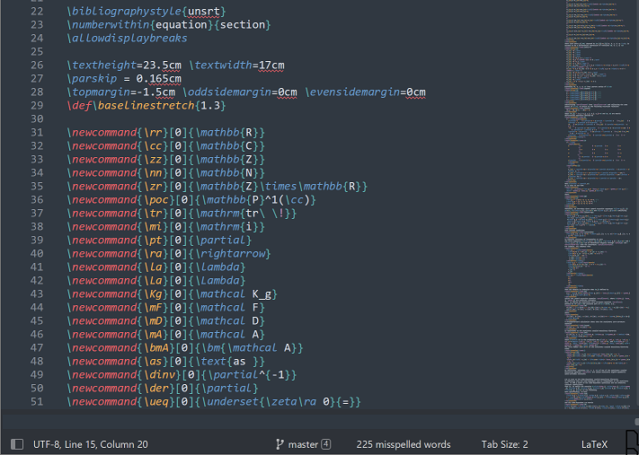
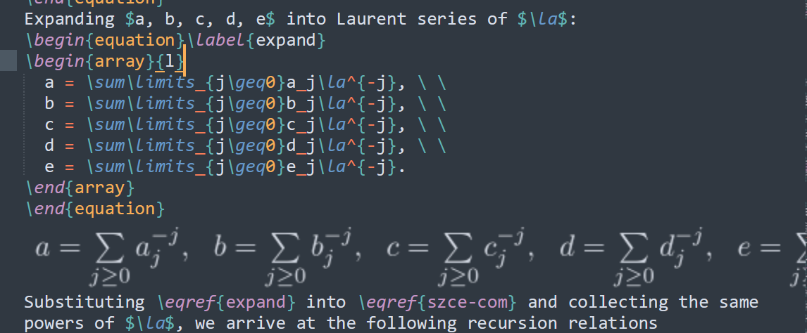

## Sublime Text
[Sublime Text (ST)](https://www.sublimetext.com) 是一款轻量, 颜值高的编辑器.
功能类似于记事本, 能够编辑文本文件, 但是它界面更好看, 而且提供了丰富的插件等功能, 能够调用其它程序来编译或者执行.
平时用来写网页, python, tex代码等非常的便利. 
官网可以免费下载使用, 偶尔会弹窗让购买会员, 不过可以不理会.

### 常用快捷键
这款编辑器提供了非常多的快捷键, 比如快速选择单词, 选择多个相同的单词, 选择多行同时操作, 快速选择括号里面的内容, 支持多个选区同时操作等. 此外, ST支持支持正则表达式搜索等. 
|快捷键|操作|
|:-|:-|
|`Ctrl + F`|查找|
|`Ctrl + H`|替换|
|`Ctrl + D`|多选(没有选中区域时, 选中邻近的单词; 有选中区域时, 会同时选择下一个)|
|`Alt + F3`|全选选中的区域|
|`Ctrl + F6`|选择下一个拼写错误的单词(需要开启单词拼写检查, 按`F6`进行切换, 底部显示)|
|`Ctrl + Shift + F6`|选择上一个拼写错误的单词|
|`Ctrl + Shift + M`|选择鼠标邻近的括号里面的内容|
|`Ctrl + Shift + L`|选中多行后按此快捷键, 选中区域的每一行行末都会出现鼠标指针, 可以同时操作|
|`Home`|回到行首(笔记本键盘可能是`Fn + Home`)|
|`End`|回到行尾(笔记本键盘可能是`Fn + End`)|
|`Ctrl + B`|编译或者执行当前文件命令(需要安装并配置相应的设置)|
|`Ctrl + Shift + P`|打开控制面板, 提供了各种快捷命令|


### 自定义脚本
更重要的是, 它还支持(自定义)插件, 自定义脚本等等, 为编程提供了极大的便利. 比如
定义脚本(`Tools > Developer > New Snippet`)
```html
<snippet>
	<content><![CDATA[
Schr\"odinger equation 
]]></content>
	<tabTrigger>sch</tabTrigger>
</snippet>
```
保存在默认文件夹, 文件名为`sch.sublime-snippet`.
则在tex文件中输入`sch`并按`tab`键即可生成`Schr\"odinger equation `非常的方便.
注意, 只需要修改第三行和第五行, 第五行缩写需要和文件名中的一致.


### ST插件
ST支持插件功能, 有丰富的[插件市场](https://packagecontrol.io/installation), 按照上述网站首页提示下载插件管理工具(Package Control).
安装Package Control 以后, 就可以使用它来安装插件了. 
具体步骤为: 在ST中按 `Ctrl + Shift + P` 打开控制面板, 输入`ins`, 选择 `Install Package`, 稍等片刻就会弹出插件列表. 
输入想要安装的插件名, 即可安装. (左下角有提示)

> 如果点击 `install package` 后有弹框, 显示 `There are no Packages available for installation`. 这种是因为默认的插件地址无效, 需要更换. 
再次打开控制面板, 输入 `channel`, 选择 `Add Channel`, 添加新的插件地址即可. 下面是两个可以用的地址
```
https://packagecontrol.io/channel_v3.json
https://raw.githubusercontent.com/SuCicada/channel_v3.json/master/channel_v3.json
```

另外, ST提供了丰富的接口给用户, 让用户可以自定义插件, 这些插件使用python来编写.
在打tex时, 想要删除某个行内公式, 需要动用鼠标, 比较麻烦. 为此, 我们来写一个插件, 通过快捷键快速匹配这个行内公式, 按`del`即可删除.
代码如下
```python
import sublime
import sublime_plugin
import re

class MatchDollorCommand(sublime_plugin.TextCommand):
	def run(self, edit):
		idx_init = self.view.sel()[0].a
		idx_begin = self.view.find_by_class(idx_init, False, 4, "$");
		idx_end = self.view.find_by_class(idx_init, True, 8, "$");

		if idx_begin != -1 and idx_end != -1 and (idx_end - idx_begin) < 600:
			region = sublime.Region(idx_begin + 1, idx_end - 1);
			if re.search(r'(begin{(equation|align)|eqref)', self.view.substr(region)) == None:
				self.view.sel().add(region)
```
相关的函数可以在ST的[官方文档](https://www.sublimetext.com/docs/api_reference.html)中查看.
需要注意的是, 函数名要首字母大写(多个单词首字母大写), 且后面必须加Command. 

类似地, 可以定义快速选择引号里面内容的函数
```python
import sublime
import sublime_plugin

class MatchQuotationMarkCommand(sublime_plugin.TextCommand):
	def run(self, edit):
		idx_init = self.view.sel()[0].a
		idx_begin1 = self.view.find_by_class(idx_init, False, 4, '"')
		idx_begin2 = self.view.find_by_class(idx_init, False, 4, "'")
		if idx_begin1 > idx_begin2:
			idx_begin = idx_begin1
			idx_end = self.view.find_by_class(idx_init, True, 8, '"')
		else:
			idx_begin = idx_begin2
			idx_end = self.view.find_by_class(idx_init, True, 8, "'")

			
		if idx_begin != -1 and idx_end != -1 and (idx_end - idx_begin) < 200:
			region = sublime.Region(idx_begin + 1, idx_end - 1)
			self.view.sel().add(region)		
```
随后在快捷键定义中使用(多个单词以下划线连接, 首字母小写), 打开Sublime Text `Preferences > Key Bindings` 在右侧窗口输入
```javascript
[
	...
	},
	{ 
        "keys": ["alt+d"], "command": "match_dollor"
    },
    { 
        "keys": ["ctrl+'"], "command": "match_quotation_mark"
    },
]
```

由 ChatGPT 写的更好, 支持多选
```python
import sublime
import sublime_plugin
import re

class MatchQuotationMarkCommand(sublime_plugin.TextCommand):
    def run(self, edit):
        selections = self.view.sel()
        new_selections = []
        for sel in selections:
            # 获取光标所在位置
            pos = sel.begin()
            # 获取包含光标所在位置的引号
            quote_regions = self.view.find_by_selector('string.quoted')
            for region in quote_regions:
                if region.contains(pos):
                    # 获取引号的内容并创建新的选区
                    quote_char = self.view.substr(region)
                    string_region = self.view.extract_scope(region.begin() + 1)
                    string_region = sublime.Region(string_region.begin() + 1, string_region.end() - 1)
                    new_selections.append(string_region)
                    break
        # 更新选区
        selections.clear()
        for sel in new_selections:
            selections.add(sel)
```

## ST编写tex文件
ST自然也可以用来编辑tex文件, 平时打论文, Ctex和texlive提供的编辑器都很丑, 用起来也不方便. 而ST则非常方便又好看

虽然ST可以编辑tex文件, 但是想要使用ST来编译tex代码, 生成pdf文件, 需要安装LatexTools插件, 来调用CTEX或者texlive编译器. 
该插件提供自动补全, 编译, 还可以在编辑过程中实时预览数学公式, 极为方便.

> 注意编辑和编译不同, 编辑的意思是增删改文件内容, 而编译是指将文件生成另一种文件或者执行代码, 如将tex编译成pdf文件, 执行matlab等程序. 
只是CTEX等软件集编辑和编译为一体.

> CTEX不推荐使用, 太古老, 笨重, 过时.

### latextools配置
安装latextools插件以后, 需要配置它的设置(MacOS只需要安装有MacTex和Skim, 不需要下面的步骤), 主要是告诉它CTEX或者texlive以及SumatraPDF的路径.
通过 `Preferences > Package Settings > LaTeXTools > Settings - User` 打开其设置文件,
在213行左右, 找到`windows`, 修改下列三项
```javascript
"texpath" : "D:\\texlive\\2022\\bin\\win32;$PATH",
"distro" : "texlive",
"sumatra": "D:\\SumatraPDF\\SumatraPDF.exe",
```
如果是CTEX, 则
```javascript
"texpath" : "D:\\CTEX\\MiKTeX\\miktex\\bin;$PATH",
"distro" : "miktex",
"sumatra": "D:\\SumatraPDF\\SumatraPDF.exe",
```
这里`sumatra`是单独安装的, CTEX套装中似乎也有此软件, 不过忘了目录在哪了.

### 公式预览
latextools 公式预览时, 自定义命令无法编译, 但是可以修改`Sublime Text\Packages\LaTeXTools\st_preview`文件夹下的`preview_math.py`文件, 将自定义命令加入到第50行`default_latex_template`模板中.

### pdf跳转到ST
打开 SumatraPDF, `设置 > 选项` > 输入双击PDF文件后调用的命令行框中输入(根据软件安装目录):
- *CTEX*: `"D:/CTEX/WinEdt/WinEdt.exe" "[Open(|%f|);SelPar(%l,8)]"`
- *Sublime Text* `"D:/Sublime Text/sublime_text.exe" "%f:%l"`
> MacOS下, 需要配置Skim来跳转到ST.

### ST跳转到pdf
latextools提供了跳转功能, 不过需要设置快捷键.
打开Sublime Text `Preferences > Key Bindings` 在右侧窗口输入
```javascript
[
	...
	},
    { 
        "keys": ["ctrl+j"], "command": "jump_to_pdf"
    }
]
```
这样, 按`Ctrl + J`即可跳转至pdf对应位置.

### 拼写检查
在第一张图片的底部可以看到, ST分别显示了文件编码, 鼠标所在的位置等信息. 特别是 `225 misspelled words` 表示有255个单词拼写错误. 
当然, 这里面大部分是由于参考文献里面的人名, 但是也有单词拼写错误的.
根据前面列出的快捷键, 可以逐一检查. 
对于一些特定的词, 虽然提示错误, 但是没有问题, 这个时候可以右键该词, 选择`Add 该词`, 将其添加到词典中, 这样这个词就不会报错了.