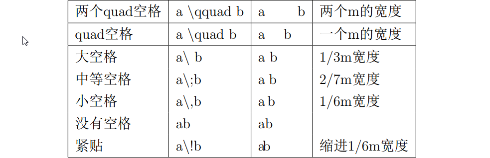
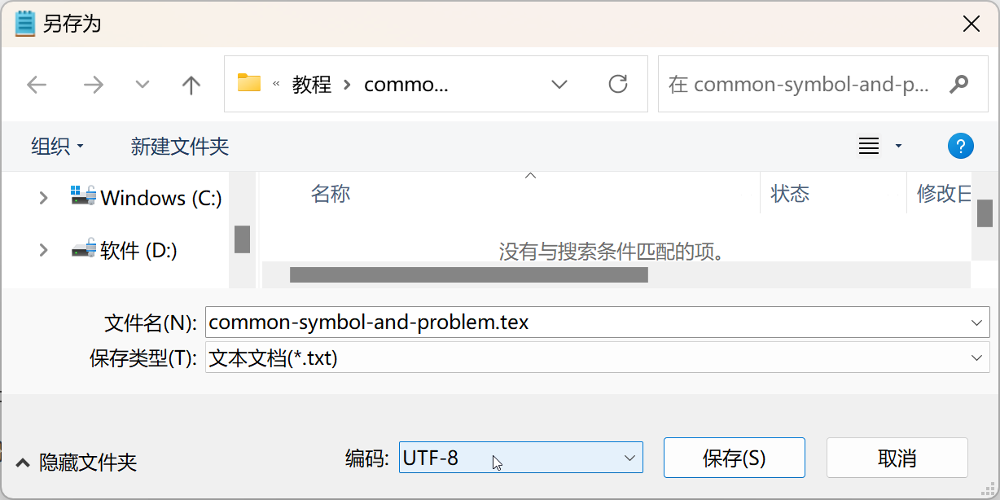
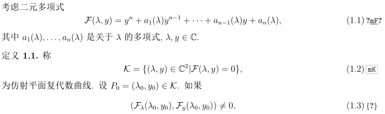
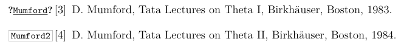
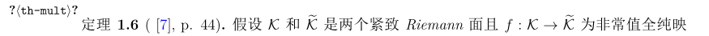
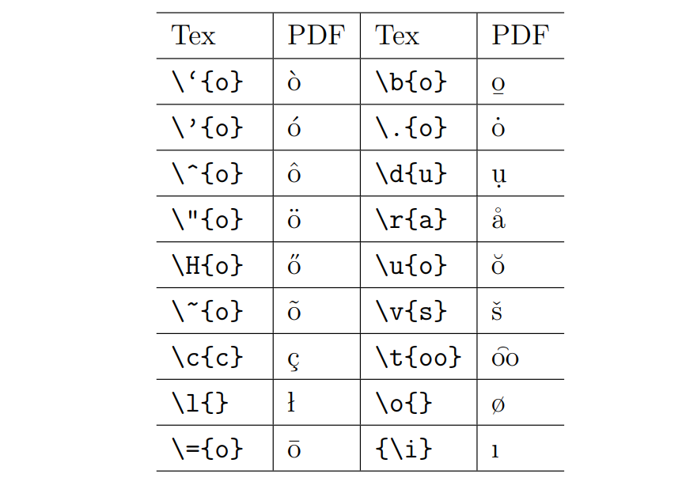



## 文档设置相关

### 章节编号问题

解决章节编号以0.开头, 这是因为没有使用chapter，直接使用section
```latex
\renewcommand\thesection{\arabic{section}}
```

### 双击pdf文件无法回到tex文件
有两方面原因, 一个是pdf软件没有设置好回到tex文件, 正常安装的情况下是可以的.
对于SumatraPDF软件, 在 `设置 > 选项 > 设置反向搜索命令行` 中输入
```
"D:/CTEX/WinEdt/WinEdt.exe" "[Open(|%f|);SelPar(%l,8)]"
```
可以回到 `CTEX`.
输入
```
"D:/Sublime Text 3/sublime_text.exe" "%f:%l"
```
可以回到Sublime Text.
当然, 需要根据自己的安装路径来修改.

另一个问题可能是文件名中有空格导致，需要重命名，不能有空格，可以以`-`或`_`替代。

### 特殊符号的使用
因部分符号在latex中作为命令的一部分，具有特殊含义，不能直接使用，如`\, &, %, {, }`.
想要使用它们，需要转义，`\`需要用`\backslash`. 
而其他符号只需在符号前边加`\`, 如`\&`.


### 生成中文pdf复制时乱码
在文档头部引入`ccmap`包即可
```latex
\usepackage{ccmap}
```

### 生成中文pdf目录乱码
对于 CTEX编译器, 只需打开命令框，依次运行下面两条命令:
```bat
gbk2uni tex文件名.out //（跟*.tex一个目录，没有就自己创建一个)
pdflatex tex文件名.tex
```

### 有序列表编号加括号
在文档头部引入
```latex
\renewcommand\labelenumi{(\theenumi)}
```

## 错误提示
tex编译器编译出错时, 通常会告诉你错误信息, 精确到某一行. 
随着用的多了, 一些简单的错误都可以很快解决.


### Tex capacity exceeded, sorry[save size = ...]
可能情况：书写错误导致超出环境最大容纳量.
这种一般出现在某个环境缺少结束`\end{...}`.
如将$\backslash$ end\{align\}写成$\backslash$ end\{align]，而后面跟有大量字符，相当于仍然在该环境中，导致超出容纳量。

### Extra alignment tab has been changed to $\backslash$cr
在使用矩阵时，实际的列数与声明的列数不同所致，如：
```latex
\left(
\begin{array}{cc}
    %此处声明为两列
    a & a & a \\
    a & a & a \\
    a & a & a \\     %实际是三列
\end{array}
\right)
```


## 数学公式相关

### 括号问题
某些数学公式因其具有分式等而高度较高，使用直接使用`()`,`[]`就显得不美观，如下：
$$(\frac{2}{3}),[\frac{2}{3}]$$
此时可以使用
```latex
\left(...\right), \left[...\right], \big(...\big), \Big[\Big], \bigg, \Bigg
```
等命令, 它们具有自适应的特性，
但要注意的是, `\left\right`中间的内容不能换行(这里指编译后的公式). 
如果想要换行, 需要如下操作
```latex
\left(blablabla \right.\\
\left. blabla \right)
```

### 公式对齐问题
我们想将下面公式
$$
\begin{align*}
   \varphi(x, \zeta)
   &=(\int^x_{-\infty}\frac{1}{2\mathrm{i}\zeta}u(\tau)\phi(\tau, \zeta)e^{\mathrm{i}\zeta \tau}d\tau + 1)
   e^{-\mathrm{i}\zeta x}      \\\\
   &+e^{\mathrm{i}\zeta x}\int^x_{-\infty}-\frac{1}{2\mathrm{i}\zeta}u(\tau)\phi(\tau, \zeta)e^{-\mathrm{i}\zeta \tau}d\tau
\end{align*}
$$
的第二行开始不超过第一行的等号
$$
\begin{align*}
   \varphi(x, \zeta)
   &=(\int^x_{-\infty}\frac{1}{2\mathrm{i}\zeta}u(\tau)\phi(\tau, \zeta)e^{\mathrm{i}\zeta \tau}d\tau + 1)
   e^{-\mathrm{i}\zeta x}      \\\\
   &\ \ \ \ + e^{\mathrm{i}\zeta x}\int^x_{-\infty}-\frac{1}{2\mathrm{i}\zeta}u(\tau)\phi(\tau, \zeta)e^{-\mathrm{i}\zeta \tau}d\tau
\end{align*}
$$
可以使用下述添加空格的方法


## 文件编码问题
文件编码问题和多语言相关, 为了支持更多的字符, 从最开始的英文字符, 到汉语, 韩语, 日语等字符, 字符集也越来越多, 文件编码也很多. 
常见的有`UTF-8`, `GBK`, `ASCII`, `unicode`等.
读取或写入文件时，未正确匹配文件编码可能会导致发生异常或产生不正确的结果. 
这常见于不同软件创建的文件, 以及不同的系统(如Windows/MacOS)创建的文件导致的.

### 编译PDF乱码/tex文件打不开
可能的原因有以下几种:

**文档类不支持中文, 但tex文件中有中文字符或者其它特殊字符**

解决办法是使用支持中文字符的文档类, 如`ctexart`.

**编码问题**

可以尝试如下几种解决办法
- 用tex编译器新建tex文件, 然后用记事本打开旧文件, 把内容复制到新的文件中, 保存, 尝试运行.

- 在tex文件开头添加声明
    ```latex
    % !Mode:: "TeX:UTF-8"
    % !TEX program = xelatex

    \documentclass[12pt]{article}
    ```
    保存重新运行

- 用记事本打开tex文件, 选择`另存为`, 如下所示

    底部编码选择`ANSI`或者`UTF-8`后保存. 然后删除文件后缀`.txt`, 尝试运行.


## 引用检查
在写论文时, 可能会出现列出的参考文献未引用, 
这种错误应该尽量避免.
可以引入 `refcheck` 包来进行检查. 首先在文档开始引入
```latex
\usepackage{refcheck}
```
这个包会在所有具有编号但没有被引用的公式, 定理, 参考文献等附近添加问号, 如下所示:
- 方程有标签但没有被引用, 有标签且被引用, 没有标签且没有被引用

- 参考文献(未)被引用

- 定理未被引用

通常只需要处理未被引用的参考文献即可.

## 一些特殊符号

### 数学符号
$$
\begin{align*}
&\overset{\Delta}{=},\\
&\xlongequal[down]{up}
\end{align*}
$$
```latex
\overset{\Delta}{=}, \xlongequal[down]{up}
```

### 字母

